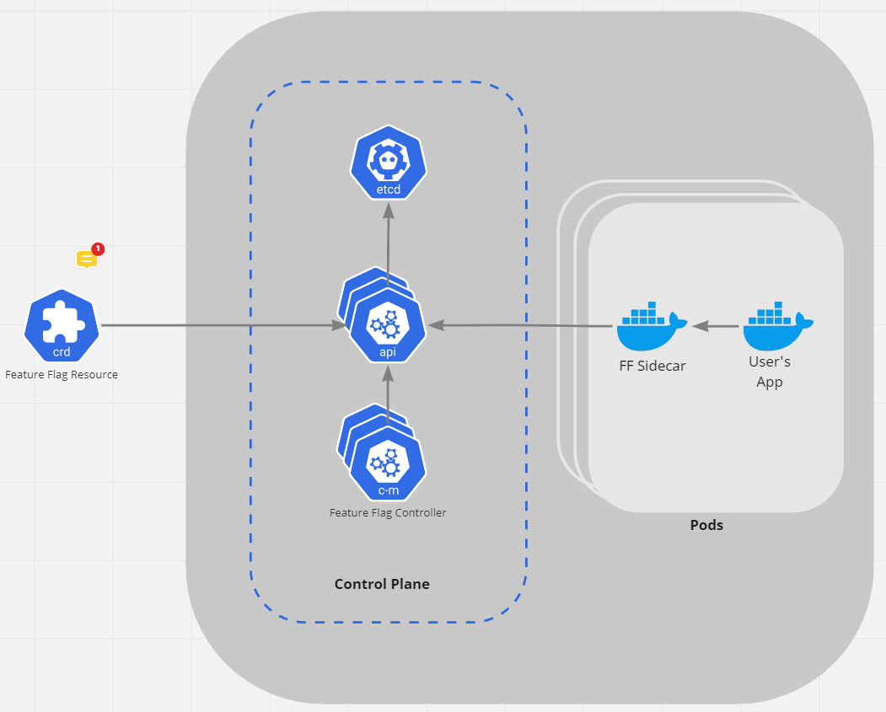
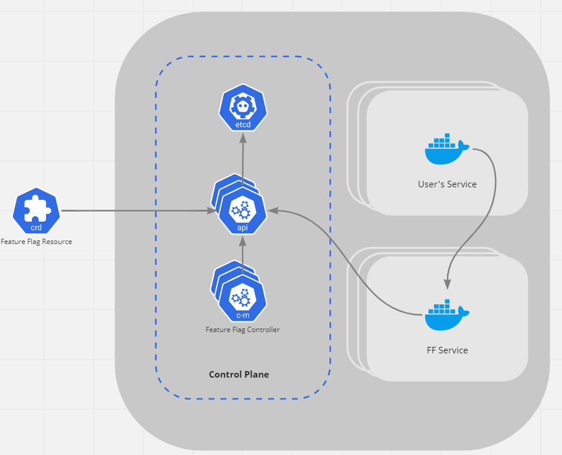

# OpenFeature specification (draft)

This repository includes the high-level architecture for the project,
and also specifications for all key interfaces and components of the project.

> :warning: This is a draft version that includes key concepts.
> More Details are coming soon!
> See [this issue](https://github.com/openfeatureflags/spec/issues/4) for the scope of the alpha version.

## Key concepts

The OpenFeature project follows the following architecture concepts:

- Cloud Native architecture, based on the common technology stacks
  and open source projects from the [Cloud Native Landscape](https://landscape.cncf.io/). 
- Extensibility for open source and commercial offerings.    
- Unified API and SDK for feature flag management in different technology stacks.
- Feature Flag evaluation logic is externalized into a separate container or a service.
  Introducing new rules and evaluation logic should not require updating all the apps.
- Feature flag configurations are stored along with the project and
  hence managed along with the application (a.k.a "Feature Flags as Code")
- Built-in support for observability tools tools and standards
  like OpenTelemetry and possibly CloudEvents

## Architecture

The architecture includes a control plane and also containerized Feature Flag services.
The system is managed through Custom Resource Definitions (CRDs) or APIs,
both are served by the control plane.

* **Feature Flag Resource** is a custom CRD type that defines feature flags and evaluation logic for the system.
* **Control Plane** includes the Feature Flag controller services, `etcd` based storage,
  and API services that handle external requests and CRDs.
* **Feature Flag Service (_FF Service_)** provides feature flag management and evaluation to user applications.
  It can run as sidecar containers or as a standalone service,
  depending on the user application architecture.

There might be additional operator services inside or outside the control plane that 
manage the system and integrate _Feature Flag Resource_ submission its system management approaches
like GitOps.

Sidecar container architecture: 

Feature Flag Service architecture:

### SDKs and client libraries

The project aims to provide a unified API and SDK for feature flag management in different technology stacks.
Thanks to the cloud native architecture and standalone services,
the management and rule evaluation logic will need to be implemented only once.
The technology specific logic will be limited to client libraries used in user apps
to connect to their _Feature Flag Service_.

The OpenFeature project will include client libraries for common technology stacks including, but not limited to:

* Golang
* Java
* JavaScript/TypeScript

These client libraries might be automatically based on the API of the _Feature Flag Service_,
e.g. if REST API or gRPC are chosen for this service.

## Reference implementation

As a part of the OpenFeature project,
a developer-first cloud-native reference implementation
should be created and made available within the project.
