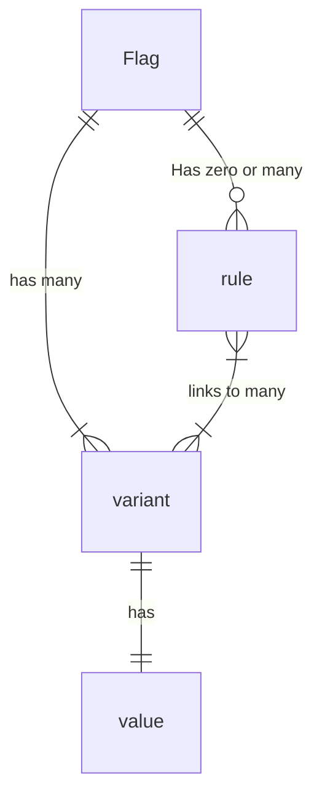

# Glossary

This document defines some terms that are used across this specification.

<details>
<summary>Table of Contents</summary>

<!-- toc -->

- [User Roles](#user-roles)
  * [Application Author](#application-author)
  * [Provider Author](#provider-author)
  * [Integration Author](#integration-author)
  * [Library Author](#library-author)
- [Common](#common)
  * [Feature Flag SDK](#feature-flag-sdk)
  * [Feature Flag API](#feature-flag-api)
  * [Provider](#provider)
  * [Integration](#integration)
  * [Context](#context)

<!-- tocstop -->

</details>

## User Roles

### Application Author

A developer of an application or service which utilizes the feature flags SDK. This person writes code which calls into the SDK to make flagging decisions.

### Application Integrator

A developer who is setting up or configuring an application or service to use the feature flags SDK. They would write code like "We should speak to the open source flagging service, not $vendor" or "The way the system should handle telemetry is through $library".

### Provider Author

The maintainer of an API-compliant provider which implements the necessary interfaces required for flag evaluation.

### Integration Author

The maintainer of an API-compliant integration which implements additional secondary functionality besides flag evaluation.

### Library Author

The maintainer of a shared library which is a dependency of many applications or libraries, which utilizes the feature flags SDK to allow consumers to manage library functionality.

## Common

### Feature Flag SDK

The libraries used by Application Author to implement feature flags in their application or service. The interfaces defined in these libraries adhere to the Feature Flag API.

### Feature Flag API

The interfaces and abstractions used by authors (Application, Integration, Provider).

Provider & Integration authors adhere to the API to add support for their feature flag implementation or integration.
Application authors use it via the Feature Flag SDK.

### Provider

An SDK-compliant feature flag implementation which adheres to the Feature Flag API. Implementations may include Saas feature flag vendors, custom "in-house" feature flag infrastructure, or open-source implementations.

### Integration

An SDK-compliant secondary function that is abstracted by the Feature Flag API, and requires only minimal configuration by the Application Author. Examples include telemetry, tracking, custom logging and monitoring.

### Context

The flag evaluation context, which may contain information about the runtime environment, details of the transport method encapsulating the flag evaluation, the host, the client, the subject (user), etc.

## Flagging specifics



### Flag

Flags represent a single pivot point of logic. Flags have a type, like `string`, `boolean`, `json`, etc. Examples: `redesign_enabled` or `header-order`

### Variant
A variant the name for a unique value for a flag. So for the `header-order` flag, we may have variants like `reverse`, `wonky` or `standard`.

### Values
Individual variants have values associated with them. These values adhere to the flag's type. For the `header-order` variants, we may have values like:

```
reverse: [5,4,3,2,1]
wonky: [3,5,2,1,4]
standard: [1,2,3,4,5]
```

### Rule

A rule is some criteria that's used to determine which variant a particular context should be mapped to.
