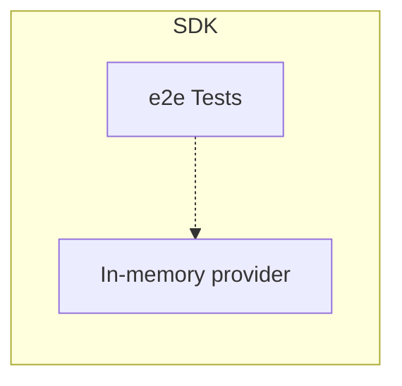

# Appendix A: Included Utilities

This document contains requirements for auxiliary utilities provided by the SDK, such as testing utilities.

## In-memory provider

> Language specific OpenFeature SDK implementations **SHOULD** expose an in-memory provider built into the SDK.

The in-memory provider is intended to be used for testing, SDK consumers may use it for their use cases.
Hence, the packaging, naming and access modifiers must be set appropriately.

Given below are features this provider **MUST** support,

- Provider must be initiated with a pre-defined set of flags provided to a constructor
- Feature Flag structure must be minimal but should help testing OpenFeature specification
- EvaluationContext support should be provided through callbacks/lambda expressions
- Provider must support a means of updating flag values, resulting in the emission of `PROVIDER_CONFIGURATION_CHANGED` events
- Provider must be maintained to support specification changes

## SDK end-to-end testing

> E2E tests must utilize [in-memory provider](#in-memory-provider) defined within the SDK and must be self-contained.

OpenFeature project maintains end-to-end(e2e) test suite defined with [Gherkin syntax](https://cucumber.io/docs/gherkin/).
These test definitions resides in [OpenFeature test-harness](https://github.com/open-feature/test-harness) repository.

