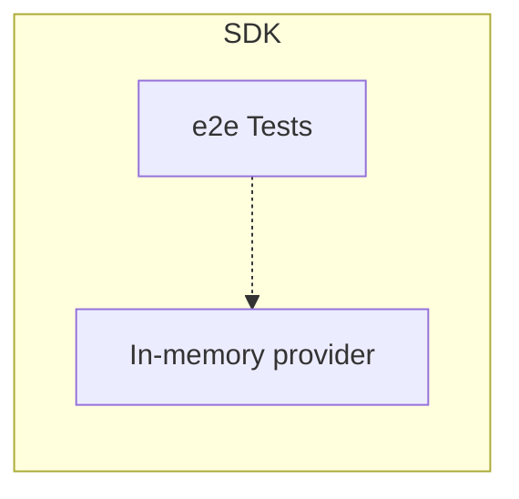

# Appendix A: Included Utilities

This document contains requirements for auxiliary utilities provided by the SDK, such as testing utilities.

## In-memory provider

> OpenFeature SDK implementations **SHOULD** provide an `in-memory provider`.

The in-memory provider is intended to be used for testing; SDK consumers may use it for their use cases.
Hence, the packaging, naming, and access modifiers must be set appropriately.

Given below are features this provider **MUST** support,

- Provider must be initiated with a pre-defined set of flags provided to a constructor
- Feature Flag structure must be minimal but should help to test OpenFeature specification
- EvaluationContext support should be provided through callbacks/lambda expressions
- Provider must support a means of updating flag values, resulting in the emission of `PROVIDER_CONFIGURATION_CHANGED` events
- Provider must be maintained to support specification changes

## SDK end-to-end testing

> E2E tests must utilize [in-memory provider](#in-memory-provider) defined within the SDK and must be self-contained.

OpenFeature project maintains an end-to-end(e2e) test suite defined with [Gherkin syntax](https://cucumber.io/docs/gherkin/).
These test definitions reside in [Appendix B](./appendix-b-gherkin-suites.md)



## Multi-Provider

### Introduction

The OpenFeature Multi-Provider wraps multiple underlying providers in a unified interface, allowing the SDK client to transparently interact with all those providers at once.
This allows use cases where a single client and evaluation interface is desired, but where the flag data should come from more than one source.

Some examples:

- A migration from one feature flagging provider to another.
  During that process, you may have some flags that have been ported to the new system and others that haven’t.
  Therefore you’d want the Multi-Provider to return the result of the “new” system if available otherwise, return the "old" system’s result.
- Long-term use of multiple sources for flags.
  For example, someone might want to be able to combine environment variables, database entries, and vendor feature flag results together in a single interface, and define the precedence order in which those sources should be consulted.

Check the [OpenFeature JavaScript Multi-Provider](https://github.com/open-feature/js-sdk-contrib/tree/main/libs/providers/multi-provider) for a reference implementation.

### Basics

The provider is initialized by passing a list of provider instances it should evaluate.
The order of the array defines the order in which sources should be evaluated.
The provider whose value is ultimately used will depend on the “strategy” that is provided, which can be chosen from a set of pre-defined ones or implemented as custom logic.

For example:

```typescript
const multiProvider = new MultiProvider(
 [
  {
   provider: new ProviderA(),
  },
  {
   provider: new ProviderB()
  }
 ],
 new FirstMatchStrategy()
)
```

From the perspective of the SDK client, this provider will now act as a “normal” spec-compliant provider, while handling the complexities of aggregating multiple providers internally.

### Specific Behavior

When dealing with many providers at once, various aspects of those providers need to be “combined” into one unified view.
For example, each internal provider has a “status”, which should influence the Multi-Provider’s overall “status”.
The specific aspects that need to be addressed are described below.

#### Unique Names

In order to identify each provider uniquely, it must have a name associated with it.
The unique name will be used when reporting errors and results in order to indicate from which provider they came from.

Most providers have a `metadata.name` field which could be used, but this would be non-unique in the case where two instances of the same type of provider are used. As a result there would need to be a way to differentiate the two.

When instantiating the Multi-Provider, there will be an option for specifying a name to associate to each provider:

```typescript
const multiProvider = new MultiProvider([
 {
  provider: new ProviderA(),
  name: "ProviderA"
 },
 {
  provider: new ProviderB(),
  name: "ProviderB"
 }
])
```

Names for each provider are then determined like this:

1. name passed in to constructor if specified
2. `metadata.name` if it is unique among providers
3. `${metadata.name}_${index}` if name is not unique. Eg. the first instance of ProviderA provider might be named “providerA_1” and the second might be “providerA_2”

If multiple names are passed in the constructor which conflict, an error will be thrown.

#### Initialization

Initialization of each provider should be handled in parallel in the Multi-Provider’s `initialize` method.
It should call `initialize` on each provider it is managing, and bubble up any error that is thrown by re-throwing to the client.

#### Status and Event Handling

The status of a provider is tracked in OpenFeature SDKs based on emitted events.

Provider states can be transitioned in the ways represented here:
[https://openfeature.dev/specification/sections/flag-evaluation#17-provider-lifecycle-management](https://openfeature.dev/specification/sections/flag-evaluation#17-provider-lifecycle-management)

The SDK client tracks statuses of a provider as follows:

- Initially the status is NOT_READY
- Initialize function is called (if exists) and result is awaited
- Successful initialize transitions state to READY, error result transitions to either ERROR or FATAL
- From this point onwards, status is only changed as a result of provider emitting events to indicate status-changing things have occurred.
- It can emit events like `FATAL`, `ERROR`, `STALE` and `READY` to transition to those states.

The only statuses which affect evaluation behavior at the SDK client level are `FATAL` and `NOT_READY`.
If a provider is in either of these states, evaluation will be “skipped” by the client and the default value will be returned.

Other statuses are currently “informational”. Nevertheless, the Multi-Provider will represent an overall “status” based on the combined statuses of the providers.

##### Multi-Provider Status

The Multi-Provider mimics the event handling logic that tracks statuses in the SDK, and keeps track of the status of each provider it is managing.

The individual status-changing events from these providers will be “captured” in the Multi-Provider, and not re-emitted to the outer SDK UNLESS they cause the status of the Multi-Provider to change.

The status of the Multi-Provider will change when one of its providers changes to a status that is considered higher “precedence” than the current status.

The precedence order is defined as:

- FATAL
- NOT_READY
- ERROR
- STALE
- READY

For example, if all providers are currently in “READY” status, the Multi-Provider will be in “READY” status.
If one of the providers is “STALE”, the status of the Multi-Provider will be “STALE”. If a different provider now becomes “ERROR”, the status will be “ERROR” even if the other provider is still in “STALE”.

When the Multi-Provider changes status, it does so by emitting the appropriate event to the SDK.
The “details” of that event will be **identical** to the details of the original event from one of the inner providers which triggered this state change.

There is another event called “configuration changed” which does not affect status.
This event should be re-emitted any time it occurs from any provider.

#### Evaluation Result

The evaluation result is based on the results from evaluating each provider.
There are multiple “strategies” configurable in the Multi-Provider to decide how to use the results.

##### Interpreting Errors

Currently, providers have multiple ways of signalling evaluation errors to the SDK.
Particularly in the case of Javascript, a provider can return an evaluation result that contains an error code and message, but still has a “value” for the result. It can also throw an error.

Several providers currently use the former approach for indicating errors in operations, and use the `value` field of the result to return the default value from the provider itself.

For the purposes of aggregating providers, the Multi-Provider treats both thrown and returned errors as an “error” result. If the returned error result has a value, that value will be ignored by all strategies. Only “nominal” evaluation results will be considered by the evaluation.

##### Strategies

The Multi-Provider supports multiple ways of deciding how to evaluate the set of providers it is managing, and how to deal with any errors that are thrown.

Strategies must be adaptable to the various requirements that might be faced in a multi-provider situation.
In some cases, the strategy may want to ignore errors from individual providers as long as one of them successfully responds.
In other cases, it may want to evaluate providers in order and skip the rest if a successful result is obtained.
In still other scenarios, it may be required to always call every provider and decide what to do with the set of results.

The strategy to use is passed in to the Multi-Provider constructor as follows:

```typescript
new MultiProvider(
 [
  {
   provider: new ProviderA()
  },
  {
   provider: new ProviderB()
  }
 ],
 new FirstMatchStrategy()
)
```

By default, the Multi-Provider uses the “FirstMatchStrategy”.

Here are some standard strategies that come with the Multi-Provider:

###### First Match

Return the first result returned by a provider.
Skip providers that indicate they had no value due to `FLAG_NOT_FOUND`.
In all other cases, use the value returned by the provider.
If any provider returns an error result other than `FLAG_NOT_FOUND`, the whole evaluation should error and “bubble up” the individual provider’s error in the result.

As soon as a value is returned by a provider, the rest of the operation should short-circuit and not call the rest of the providers.

###### First Successful

Similar to “First Match”, except that errors from evaluated providers do not halt execution.
Instead, it will return the first successful result from a provider. If no provider successfully responds, it will throw an error result.

###### Comparison

Require that all providers agree on a value.
If every provider returns a non-error result, and the values do not agree, the Multi-Provider should return the result from a configurable “fallback” provider.
It will also call an optional “onMismatch” callback that can be used to monitor cases where mismatches of evaluation occurred.
Otherwise the value of the result will be the result of the first provider in precedence order.

###### User Defined

Rather than making assumptions about when to use a provider’s result and when not to (which may not hold across all providers) there is also a way for the user to define their own strategy that determines whether or not to use a result or fall through to the next one.

A strategy can be implemented by implementing the `BaseEvaluationStrategy` class as follows:

```typescript
type StrategyEvaluationContext = {
  flagKey: string;
  flagType: FlagValueType;
};

type StrategyPerProviderContext = StrategyEvaluationContext & {
  provider: Provider;
  providerName: string;
  providerStatus: ProviderStatus;
};

type ProviderResolutionResult<T extends FlagValue> = {
 details: ResolutionDetails<T>;
  thrownError?: unknown;
  provider: Provider;
  providerName: string;
}
type FinalResult = {
  details?: ResolutionDetails<unknown>;
  provider?: Provider;
  providerName?: string;
  errors?: {
    providerName: string;
    error: unknown;
  }[];
};

abstract class BaseEvaluationStrategy {
 runMode: 'parallel' | 'sequential'
  
  abstract shouldEvaluateThisProvider(
   strategyContext: StrategyPerProviderContext, 
   evalContext: EvaluationContext
  ): boolean;

  abstract shouldEvaluateNextProvider<T extends FlagValue>(
    strategyContext: StrategyPerProviderContext,
    context: EvaluationContext,
    result: ProviderResolutionResult<T>
  ): boolean;

  abstract determineFinalResult<T extends FlagValue>(
    strategyContext: StrategyEvaluationContext,
    context: EvaluationContext,
    resolutions: ProviderResolutionResult<T>[],
  ): FinalResult;
}
```

The `runMode` property defines whether the providers will all be evaluated at once in parallel, or whether they will be evaluated one at a time with each result determining whether to evaluate the next one in order.

The `shouldEvaluateThisProvider` function is called for each provider right before the Multi-Provider would evaluate it.
If the function returns false, the provider will be skipped.
This can be useful in cases where it’s desired to skip a provider based on what flag key is being used, or based on some state from the provider itself that indicates it shouldn’t be evaluated right now.

The `shouldEvaluateNextProvider` function is called right after a provider is evaluated.
It is called with the details of resolution or any error that was thrown (which will be caught).
If the function returns true, the next provider will be called.
Otherwise all remaining providers will be skipped and the results of the ones that have been evaluated so far will be passed to `determineFinalResult` .
If this function throws an error, the Multi-Provider will throw an error and not evaluate further providers.
This function is not called when `runMode` is `parallel`, since all providers will be executed (as long as they individually pass the `shouldEvaluateThisProvider` check)

The `determineFinalResult` function is called after the resolution stage if no further providers will be called.
This function can be used to decide from the set of resolutions which one should ultimately be used.
The function must return a `FinalResult` object which contains the final “ResolutionDetails” and the provider that they correspond to, or an array of “errors” in the case of a non-successful result, with the provider that created each error.

To see reference implementations of the above-mentioned strategies, check out the source

[https://github.com/open-feature/js-sdk-contrib/tree/main/libs/providers/multi-provider/src/lib/strategies](https://github.com/open-feature/js-sdk-contrib/tree/main/libs/providers/multi-provider/src/lib/strategies)

#### Hooks

Provider hooks are capable of modifying the context before an evaluation takes place.
This behavior must be preserved, but it’s also necessary to prevent these hooks from interfering with the context being passed to other providers.

For this reason, the Multi-Provider manages calling the hooks of each provider itself, at the appropriate time.
It then uses the result of the before hooks for a given provider as the new evaluation context when evaluating *that provider*, without affecting the context used for other providers.

It then calls the after, error and finally hooks using the appropriate context as well.

Errors thrown from these hooks are be bubbled up to the client, depending on how the evaluation “strategy” defines what to do with errors.

#### Shutdown

The shutdown method should ensure that “shutdown” is called in all underlying providers, and bubble up any errors to the client

#### Error Handling

In cases where all providers are being called (Evaluation etc.) there may be more than one error encountered from more than one provider.
The Multi-Provider will collect and throw all errors in an aggregated form as follows:

```javascript
error = {
  message: 'some message',
  code: SOME_ERROR,
  // which provider caused the error
  originalErrors: [
   {
     source: 'ProviderA',
   error: {
      message: 'something',
   }
   }
  ]
}
```

In the case where only one error is thrown by one provider, it will still throw in this form for consistency.

Other errors from the Multi-Provider itself will use standard error types.

#### Metadata

Providers can contain metadata. The Multi-Provider will make that metadata available within its own metadata as follows:

```javascript
{
  name: 'multiprovider',
 originalMetadata: {
  providerA: {...},
  providerB: {...}
 },
}
```

## Logging Hook

> OpenFeature SDK implementations **SHOULD** provide a `logging hook`.

The logging hook is a hook which logs messages during the flag evaluation life-cycle as described below:

| Stage   | Logged data                                                                                                                                   |
| ------- | --------------------------------------------------------------------------------------------------------------------------------------------- |
| before  | `stage`, `domain`, `provider_name`, `flag_key`, `default_value` and `evaluation_context` (serialized, opt-in)                                 |
| after   | `stage`, `domain`, `provider_name`, `flag_key`, `default_value`, `evaluation_context` (serialized, opt-in), `reason`, `variant` and `value`   |
| error   | `stage`, `domain`, `provider_name`, `flag_key`, `default_value`, `evaluation_context` (serialized, opt-in), `error_code`, and `error_message` |
| finally | N/A                                                                                                                                           |

> The evaluation context **SHOULD** only be logged if an associated option indicates so.

This can be a constructor option or similar, for example: `boolean printContext`.

> If logging the evaluation context is enabled, it **MUST** be printed in such a way that it's human readable.

Consider printing the evaluation context as a stringified JSON object, or using some other format that allows the nested properties to be easily read.

> If the logger abstraction in the SDK supports a log level concept, the appropriate log level **SHOULD** be used for each stage (before/after: debug/info, error: error).

Consider using `debug` or `info` levels for the `before` and `after` stages, and the `error` level for the `error` stage.
