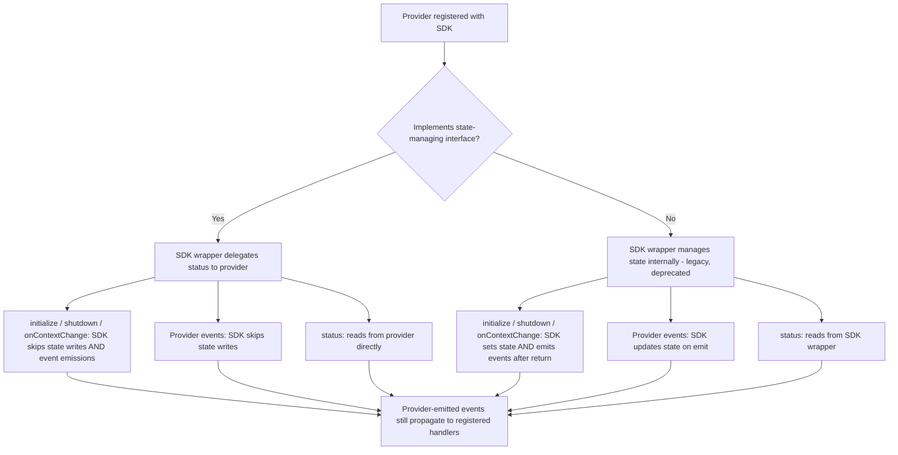

# Appendix E: Migrations

This appendix provides non-normative guidance for provider authors and SDK authors on migrating to new or changed specification requirements.

## Provider Status Ownership

### Background

Prior to `v0.9.0`, provider status (e.g. `NOT_READY`, `READY`, `ERROR`) was managed by the SDK on behalf of the provider.
The SDK would set status and emit events after lifecycle methods (`initialize`, `shutdown`, `on context change`) returned.
This created a race condition in multi-threaded SDKs: the provider could change its own state (e.g. emit an error event from a background thread) in the window between the lifecycle method returning and the SDK writing its post-lifecycle status and emitting the corresponding event.
The result was incorrect event ordering and inconsistent status.

The spec now requires providers to own their status and emit events atomically with status transitions (see [provider status](./sections/02-providers.md#28-provider-status)).

### For provider authors

Providers are now responsible for maintaining their own `status` and emitting events atomically with status transitions.

#### What to implement

- A `status` accessor returning the provider's current readiness: `NOT_READY`, `READY`, `STALE`, `ERROR`, or `FATAL` (plus `RECONCILING` in the static-context paradigm)
- `status` must be `NOT_READY` before `initialize` is called and after `shutdown` terminates
- `status` must be safe for concurrent access
- Status transitions and associated event emissions must be atomic from the perspective of external observers; set the status before emitting the corresponding event

#### The `StateManagingProvider` interface

To signal to the SDK that your provider manages its own status, implement an opt-in interface (or equivalent mechanism) defined by the SDK.
This interface should expose:

- A `status` accessor that returns the provider's current status
- A discriminant or marker (e.g. an additional interface, a boolean property, or a type-level tag) that allows the SDK to detect at registration time that the provider manages its own state

Providers that do not implement this interface will continue to have their status managed by the SDK.
This legacy behavior is deprecated and will be removed in the next major version.

### For SDK authors

SDKs must detect whether a registered provider manages its own state and branch behavior accordingly.

#### Detecting state-managing providers

At registration time, check whether the provider implements the `StateManagingProvider` interface (or equivalent).
Store this as a flag on the internal provider wrapper for use during lifecycle calls and event handling.

#### SDK wrapper behavior

SDKs typically wrap registered providers in an internal adapter (e.g. a "provider wrapper" or "state manager") that mediates lifecycle calls and event forwarding.
The wrapper should branch based on whether the registered provider implements the state-managing interface.

#### What the SDK skips for state-managing providers

For providers that implement the state-managing interface, the SDK must not perform any of the following actions that it would normally perform for legacy providers:

- Setting status to `READY` after `initialize()` succeeds
- Setting status to `ERROR` or `FATAL` after `initialize()` fails
- Setting status to `NOT_READY` after `shutdown()` completes
- Emitting `PROVIDER_READY` or `PROVIDER_ERROR` events after `initialize()`
- Updating status when the provider emits events at runtime (the provider already set its own status atomically with the event)
- (Static-context paradigm only) Setting `RECONCILING` status, emitting `PROVIDER_RECONCILING`, setting `READY`/`ERROR` status, or emitting `PROVIDER_CONTEXT_CHANGED`/`PROVIDER_ERROR` during `on context change` handling

#### What the SDK still does for all providers

Regardless of whether the provider manages its own state, the SDK continues to:

- Call `initialize()`, `shutdown()`, and `on context change` lifecycle methods on the provider
- Forward provider-emitted events to registered domain and API-level event handlers
- Run late-attached handlers immediately if the provider is already in the associated state
- Enforce short-circuit behavior for `NOT_READY` and `FATAL` statuses during flag evaluation

#### Deprecation

The legacy path (SDK-managed status) should be deprecated in the release that introduces the state-managing interface, with removal targeted for the next major version.
SDK authors should update any first-party providers and provider base classes to implement the new interface.
