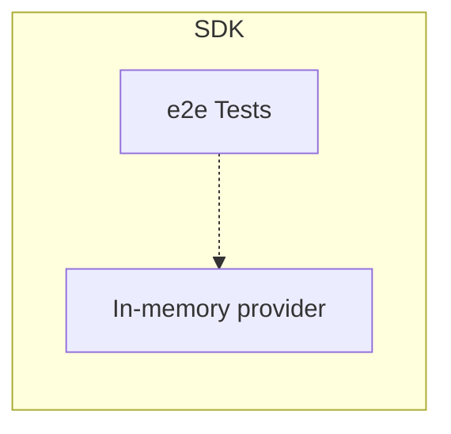

# Appendix

This document contains extra information for OpenFeature maintainers and users.

## In-memory provider

Language specific OpenFeature SDK implementations are recommended to expose an in-memory provider built into the SDK.
This in-memory provider is intended to be used for testing and may serve as a reference implementation.

Given below are features this provider should support,

- Provider must be initiated with a pre-defined set of flags provided to a constructor
- Feature Flag structure must be minimal but should help testing requirements
- EvaluationContext support should be provided through callbacks/lambda expressions to minimize implementation efforts
- Provider must continue to support new specification enhancements

## SDK end-to-end testing

OpenFeature project maintains end-to-end(e2e) test suite defined with [Gherkin syntax](https://cucumber.io/docs/gherkin/).
These test definitions resides in [OpenFeature test-harness](https://github.com/open-feature/test-harness) repository.

E2E tests must utilize [in-memory provider](#in-memory-provider) defined withing the SDK and must be self-contained.

