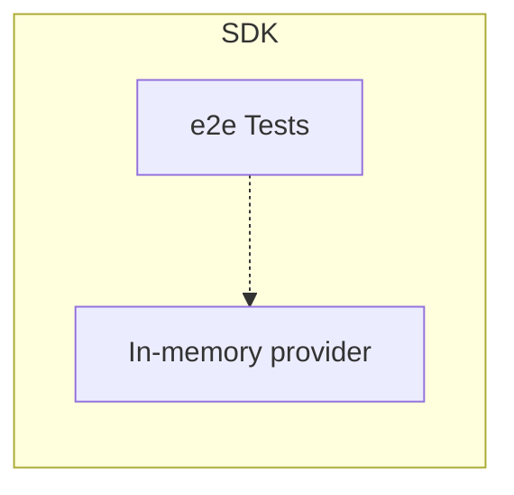

# Appendix

This document contain extra information for OpenFeature maintainers and users.

## SDK Testing

OpenFeature project maintain end-to-end(e2e) test suite defined with [Gherkin syntax](https://cucumber.io/docs/gherkin/).
As proposed through [OFEP: SDK end-to-end test strategy](https://github.com/open-feature/ofep/pull/71/files), these e2e tests should be implemented within language specific SDK itself.
Further, as discussed in the same OFEP, tests must use in-memory provider bundled within each SDK.

