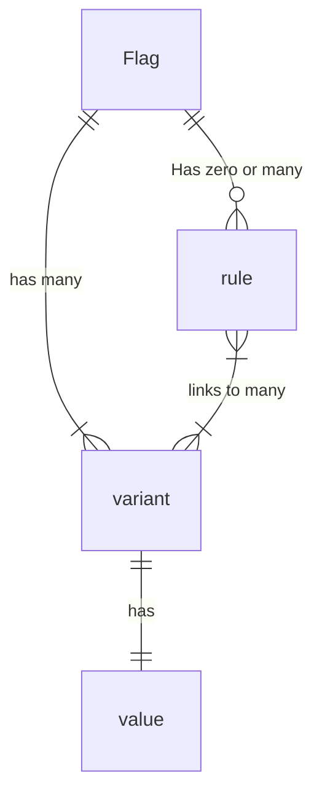

# Glossary

This document defines some terms that are used across this specification.

<details>
<summary>Table of Contents</summary>

<!-- toc -->

- [User Roles](#user-roles)
  - [Application Author](#application-author)
  - [Provider Author](#provider-author)
  - [Integration Author](#integration-author)
  - [Library Author](#library-author)
- [Common](#common)
  - [Feature Flag SDK](#feature-flag-sdk)
  - [Feature Flag API](#feature-flag-api)
  - [Provider](#provider)
  - [Integration](#integration)
  - [Evaluation Context](#evaluation-context)

<!-- tocstop -->

</details>

## User Roles

### Application Author

A developer of an application or service which utilizes the feature flags SDK. This person writes code which calls into the SDK to make flagging decisions.

### Application Integrator

A developer who is setting up or configuring an application or service to use the feature flags SDK. They would write code like "We should speak to the open source flagging service, not $vendor" or "The way the system should handle telemetry is through $library".

### Provider Author

The maintainer of an API-compliant [provider](./provider//providers.md) which implements the necessary interfaces required for flag evaluation.

### Integration Author

The maintainer of an API-compliant integration which implements additional secondary functionality besides flag evaluation.

### Library Author

The maintainer of a shared library which is a dependency of many applications or libraries, which utilizes the feature flags SDK to allow consumers to manage library functionality.

## Common

### Feature Flag SDK

The libraries used by Application Author to implement feature flags in their application or service. The interfaces defined in these libraries adhere to the Feature Flag API.

### Feature Flag API

The interfaces and abstractions used by authors (Application, Integration, Provider).

Provider & Integration authors adhere to the API to add support for their feature flag implementation or integration.
Application authors use it via the Feature Flag SDK.

### Evaluation API

The subset of the [Feature Flag API](#feature-flag-api) that the Application Author uses to evaluate flags.

### Flag Management System

A source-of-truth for flag values and rules. Flag management systems may include SaaS feature flag vendors, custom "in-house" feature flag infrastructure, or open-source implementations.

### Provider

An SDK-compliant implementation which resolves flag values from a particular flag management system, allowing the use of the [Evaluation API](./flag-evaluation/flag-evaluation.md#flag-evaluation) as an abstraction for the system in question.

### Integration

An SDK-compliant secondary function that is abstracted by the Feature Flag API, and requires only minimal configuration by the Application Author. Examples include telemetry, tracking, custom logging and monitoring.

### Evaluation Context

Context object for flag evaluation, which may contain information about the runtime environment, details of the transport method encapsulating the flag evaluation, the host, the client, the subject (user), etc. This data may be used as a basis for differential evaluation of feature flags based on rules that can be defined in the flag system. Context data may be provided by merging static global context, arguments to flag evaluation, and implicit language-dependant state propagation mechanisms (thread-local storage, promise chains, continuations, etc).

### Evaluating Flag Values

The process of retrieving a feature flag value in it's entirety, including:

- any effects resulting from hooks
- resolving a flag value from a configured provider
- falling back to a supplied default, in the case of abnormal execution

### Resolving Flag Values

The process of a provider retrieving a feature flag value from it's particular source-of-truth.

## Flagging specifics



### Flag

Flags represent a single pivot point of logic. Flags have a type, like `string`, `boolean`, `json`, etc. Examples: `redesign_enabled` or `header-order`

### Variant

A variant is a semantic identifier for a value. This allows for referral to particular values without necessarily including the value itself, which may be quite prohibitively large or otherwise unsuitable in some cases.

### Values

Individual variants have values associated with them. These values adhere to the flag's type. For the `header-order` variants, we may have values like:

```
reverse: [5,4,3,2,1]
wonky: [3,5,2,1,4]
standard: [1,2,3,4,5]
```

### Rule

A rule is some criteria that's used to determine which variant a particular context should be mapped to.
