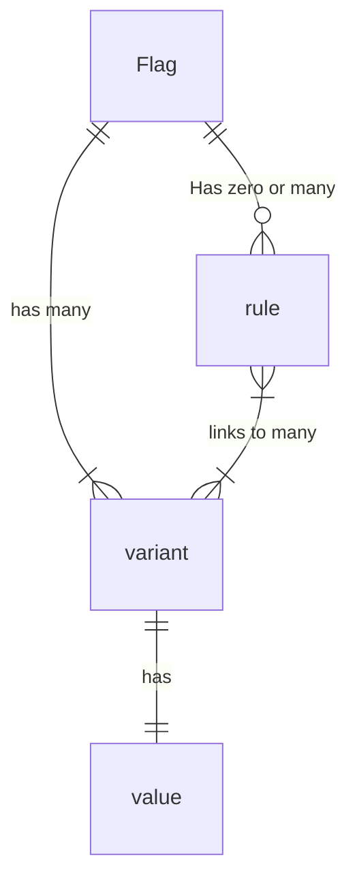

# Glossary <!-- omit from toc -->

This document defines some terms that are used across this specification.

<details>
<summary>Table of Contents</summary>

<!-- toc -->

- [Feature Flag](#feature-flag)
- [User Roles](#user-roles)
  - [Application Author](#application-author)
  - [Application Integrator](#application-integrator)
  - [Provider Author](#provider-author)
  - [Integration Author](#integration-author)
  - [Library Author](#library-author)
- [Common](#common)
  - [Feature Flag SDK](#feature-flag-sdk)
  - [Client-Side SDK](#client-side-sdk)
  - [Server-Side SDK](#server-side-sdk)
  - [Feature Flag API](#feature-flag-api)
  - [Evaluation API](#evaluation-api)
  - [Flag Management System](#flag-management-system)
  - [Provider](#provider)
  - [Domain](#domain)
  - [Integration](#integration)
  - [Evaluation Context](#evaluation-context)
  - [Evaluating Flag Values](#evaluating-flag-values)
  - [Resolving Flag Values](#resolving-flag-values)
- [Flagging specifics](#flagging-specifics)
  - [Flag](#flag)
  - [Flag Key](#flag-key)
  - [Variant](#variant)
  - [Values](#values)
  - [Targeting](#targeting)
  - [Targeting Key](#targeting-key)
  - [Fractional Evaluation](#fractional-evaluation)
  - [Rule](#rule)
- [SDK Paradigms](#sdk-paradigms)
  - [Dynamic-Context Paradigm](#dynamic-context-paradigm)
  - [Static-Context Paradigm](#static-context-paradigm)

<!-- tocstop -->

</details>

## Feature Flag

A mechanism that allows an Application Author to define alternative codepaths within a deployed piece of software, which is conditionally executed at runtime, based on a rule set.

## User Roles

### Application Author

A developer of an application or service which utilizes the feature flags SDK. This person writes code which calls into the SDK to make flagging decisions.

### Application Integrator

A developer who is setting up or configuring an application or service to use the feature flags SDK. They would write code like "We should speak to the open source flagging service, not $vendor" or "The way the system should handle telemetry is through $library".

### Provider Author

The maintainer of an API-compliant [provider](./sections/02-providers.md) which implements the necessary interfaces required for flag evaluation.

### Integration Author

The maintainer of an API-compliant integration which implements additional secondary functionality besides flag evaluation.

### Library Author

The maintainer of a shared library which is a dependency of many applications or libraries, which utilizes the feature flags SDK to allow consumers to manage library functionality.

## Common

### Feature Flag SDK

The libraries used by the Application Author to implement feature flags in their application or service. The interfaces defined in these libraries adhere to the Feature Flag API.

### Client-Side SDK

An SDK which is built for usage in client applications (e.g. single-page web applications), and typically uses the [static-context paradigm](#static-context-paradigm).

### Server-Side SDK

An SDK which is built for usage in server applications (e.g. REST services), and typically uses the [dynamic-context paradigm](#dynamic-context-paradigm).

### Feature Flag API

The interfaces and abstractions used by authors (Application, Integration, Provider).

Provider & Integration authors adhere to the API to add support for their feature flag implementation or integration. Application authors use it via the Feature Flag SDK.

### Evaluation API

The subset of the [Feature Flag API](#feature-flag-api) that the Application Author uses to evaluate flags.

### Flag Management System

A source-of-truth for flag values and rules. Flag management systems may include SaaS feature flag vendors, custom "in-house" feature flag infrastructure, or open-source implementations.

### Provider

An SDK-compliant implementation which resolves flag values from a particular flag management system, allowing the use of the [Evaluation API](./sections/01-flag-evaluation.md#13-flag-evaluation) as an abstraction for the system in question.

### Domain

An identifier which logically binds clients with providers, allowing for multiple providers to be used simultaneously within a single application.

### Integration

An SDK-compliant secondary function that is abstracted by the Feature Flag API, and requires only minimal configuration by the Application Author. Examples include telemetry, tracking, custom logging and monitoring.

### Evaluation Context

Context object for flag evaluation, which may contain information about the runtime environment, details of the transport method encapsulating the flag evaluation, the host, the client, the subject (user), etc. This data may be used as a basis for differential evaluation of feature flags based on rules that can be defined in the flag system. Context data may be provided by merging static global context, arguments to flag evaluation, and implicit language-dependant state propagation mechanisms (thread-local storage, promise chains, continuations, etc).

### Evaluating Flag Values

The process of retrieving a feature flag value in it's entirety, including:

- any effects resulting from hooks
- resolving a flag value from a configured provider
- falling back to a supplied default, in the case of abnormal execution

### Resolving Flag Values

The process of a provider retrieving a feature flag value from it's particular source-of-truth.

## Flagging specifics



### Flag

Flags represent a single pivot point of logic. Flags have a type, like `string`, `boolean`, `json`, etc. Examples: `redesign_enabled` or `header-order`

### Flag Key

A string that logically identifies a particular flag.

### Variant

A variant is a semantic identifier for a value. This allows for referral to particular values without necessarily including the value itself, which may be quite prohibitively large or otherwise unsuitable in some cases.

### Values

Individual variants have values associated with them. These values adhere to the flag's type. For the `header-order` variants, we may have values like:

```text
reverse: [5,4,3,2,1]
wonky: [3,5,2,1,4]
standard: [1,2,3,4,5]
```

### Targeting

The application of rules, specific user overrides, or fractional evaluations in feature flag resolution.

### Targeting Key

A string logically identifying the subject of evaluation (end-user, service, etc).

### Fractional Evaluation

Pseudorandomly resolve flag values using a context property, such as a targeting key, based on a configured proportion or percentage (ie: 50/50).

### Rule

A rule is some criteria that's used to determine which variant a particular context should be mapped to.

## SDK Paradigms

Feature flag frameworks have SDKs which operate in two distinct paradigms: those designed for use with a single user client application (e.g. mobile phones, single-page web apps), and those designed for multi-user applications, such as web server applications. Some parts of the OpenFeature specification diverge depending on the paradigm.

### Dynamic-Context Paradigm

Server-side applications typically perform flag evaluations on behalf of many users, with each request or event being associated with a particular user or client. For this reason, server frameworks typically operate similarly to this:

- the application is initialized with some static context (geography, service name, hostname, etc)
- with each request or event, relevant dynamic context (for example, user session data, unique user identifiers) is provided to flag evaluations

### Static-Context Paradigm

In contrast to server-side or other service-type applications, client side applications typically operate in the context of a single user. Most feature flagging libraries for these applications have been designed with this in mind. Frequently, client/web libraries operate similarly to this:

- an initialization occurs, which fetches evaluated flags in bulk for a given context (user)
- the evaluated flags are cached in the library
- flag evaluations take place against this cache, without a need to provide context (context was already used to evaluate flags in bulk)
- libraries provide a mechanism to update context (e.g. if a user logs in), meaning cached evaluations are no longer valid and must be re-evaluated, frequently involving a network request or I/O operation

Not all client libraries work this way, but generally, libraries that accept dynamic context per evaluation can build providers which conform to this model with relative ease, while the reverse is not true.
