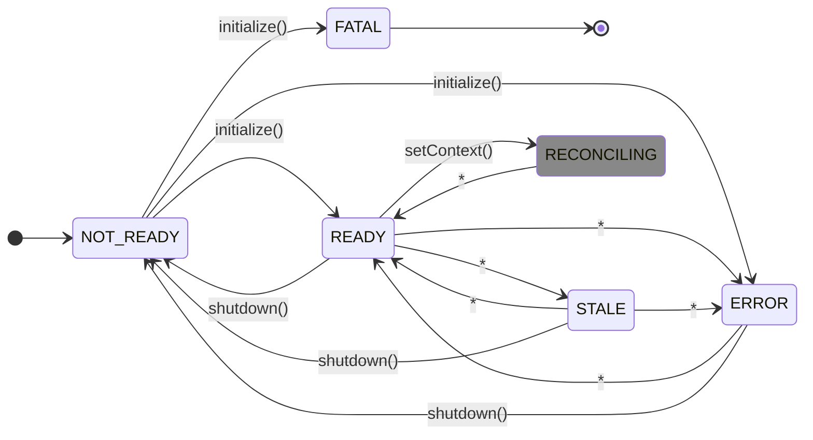

# 1. Flag Evaluation API

[](https://github.com/open-feature/spec/tree/main/specification#hardening)

## Overview

The `evaluation API` allows for the evaluation of feature flag values, independent of any flag control plane or vendor. In the absence of a [provider](./02-providers.md) the `evaluation API` uses the "No-op provider", which simply returns the supplied default flag value.

### 1.1. API Initialization and Configuration

#### Requirement 1.1.1

> The `API`, and any state it maintains **SHOULD** exist as a global singleton, even in cases wherein multiple versions of the `API` are present at runtime.

It's important that multiple instances of the `API` not be active, so that state stored therein, such as the registered `provider`, static global `evaluation context`, and globally configured `hooks` allow the `API` to behave predictably. This can be difficult in some runtimes or languages, but implementors should make their best effort to ensure that only a single instance of the `API` is used.

### Setting a provider

#### Requirement 1.1.2.1

> The `API` **MUST** define a `provider mutator`, a function to set the default `provider`, which accepts an API-conformant `provider` implementation.

```typescript
// example provider mutator
OpenFeature.setProvider(new MyProvider());
```

The example above sets the default provider.
This provider is used if a client is not bound to a specific provider via a [domain](../glossary.md#domain).

See [provider](./02-providers.md), [creating clients](#creating-clients) for details.

#### Requirement 1.1.2.2

> The `provider mutator` function **MUST** invoke the `initialize` function on the newly registered provider before using it to resolve flag values.

Application authors can await the newly set `provider's` readiness using the `PROVIDER_READY` event.
Provider instances which are already active (because they have been bound to another `domain` or otherwise) need not be initialized again.
The `provider's` readiness can state can be determined from its `status` member/accessor.

See [event handlers and initialization](./05-events.md#event-handlers-and-initialization), [provider initialization](./02-providers.md#24-initialization), [domain](../glossary.md#domain) for details.

#### Requirement 1.1.2.3

>  The `provider mutator` function **MUST** invoke the `shutdown` function on the previously registered provider once it's no longer being used to resolve flag values.

When a provider is no longer in use, it should be disposed of using its `shutdown` mechanism.
Provider instances which are bound to multiple `domains` won't be shut down until the last binding is removed.

see [shutdown](./02-providers.md#25-shutdown), [setting a provider](#setting-a-provider), [domain](../glossary.md#domain) for details.

#### Requirement 1.1.2.4

> The `API` **SHOULD** provide functions to set a provider and wait for the `initialize` function to complete or abnormally terminate.

This function not only sets the provider, but ensures that the provider is ready (or in error) before returning or settling.

```java
// default provider
OpenFeatureAPI.getInstance().setProviderAndWait(myprovider); // this method blocks until the provider is ready or in error
// client uses the default provider
Client client = OpenFeatureAPI.getInstance().getClient(); 

// provider associated with domain-1
OpenFeatureAPI.getInstance().setProviderAndWait('domain-1', myprovider); // this method blocks until the provider is ready or in error
// client uses provider associated with the domain named 'domain-1'
Client client = OpenFeatureAPI.getInstance().getClient('domain-1');
```

Though it's possible to use [events](./05-events.md) to await provider readiness, such functions can make things simpler for `application authors` and `integrators`.
Implementations indicate an error in a manner idiomatic to the language in use (returning an error, throwing an exception, etc).

#### Requirement 1.1.3

> The `API` **MUST** provide a function to bind a given `provider` to one or more clients using a `domain`. If the domain already has a bound provider, it is overwritten with the new mapping.

```java
OpenFeature.setProvider("domain-1", new MyProvider());
```

Clients can be associated with a particular provider by supplying a matching `domain` when the provider is set.

See [creating clients](#creating-clients), [domain](../glossary.md#domain) for details.

#### Requirement 1.1.4

> The `API` **MUST** provide a function to add `hooks` which accepts one or more API-conformant `hooks`, and appends them to the collection of any previously added hooks. When new hooks are added, previously added hooks are not removed.

```typescript
// example hook attachment
OpenFeature.addHooks([new MyHook()]);
```

See [hooks](./04-hooks.md) for details.

#### Requirement 1.1.5

> The `API` **MUST** provide a function for retrieving the metadata field of the configured `provider`.

```typescript
// example provider accessor
OpenFeature.getProviderMetadata();
```

It's possible to access provider metadata using a `domain`.
If a provider has not be registered under the requested domain, the default provider metadata is returned.

```typescript
// example provider accessor
OpenFeature.getProviderMetadata("domain-1");
```

See [provider](./02-providers.md), [domain](../glossary.md#domain) for details.

### Creating clients

#### Requirement 1.1.6

> The `API` **MUST** provide a function for creating a `client` which accepts the following options:
>
> - domain (optional): A logical string identifier for binding clients to provider.

```java
// example client creation and retrieval
OpenFeature.getClient();
```

It's possible to create a client that is associated with a `domain`.
The client will use a provider in the same `domain` if one exists, otherwise, the default provide is used.

```java
// example client creation and retrieval using a domain
OpenFeature.getClient("domain-1");
```

See [setting a provider](#setting-a-provider), [domain](../glossary.md#domain) for details.

#### Requirement 1.1.7

> The client creation function **MUST NOT** throw, or otherwise abnormally terminate.

Clients may be created in critical code paths, and even per-request in server-side HTTP contexts. Therefore, in keeping with the principle that OpenFeature should never cause abnormal execution of the first party application, this function should never throw. Abnormal execution in initialization should instead occur during provider registration.

### 1.2. Client Usage

#### Requirement 1.2.1

> The client **MUST** provide a method to add `hooks` which accepts one or more API-conformant `hooks`, and appends them to the collection of any previously added hooks. When new hooks are added, previously added hooks are not removed.

```typescript
// example hook attachment
client.addHooks([new MyHook()]);
```

See [hooks](./04-hooks.md) for details.

#### Requirement 1.2.2

> The client interface **MUST** define a `metadata` member or accessor, containing an immutable `domain` field or accessor of type string, which corresponds to the `domain` value supplied during client creation.

```typescript
client.getMetadata().getDomain(); // "domain-1"
```

In previous drafts, this property was called `name`.
For backwards compatibility, implementations should consider `name` an alias to `domain`.

### 1.3. Flag Evaluation

[](https://github.com/open-feature/spec/tree/main/specification#hardening)

#### Condition 1.3.1

> The implementation uses the dynamic-context paradigm.

see: [dynamic-context paradigm](../glossary.md#dynamic-context-paradigm)

##### Conditional Requirement 1.3.1.1

> The `client` **MUST** provide methods for typed flag evaluation, including boolean, numeric, string, and structure, with parameters `flag key` (string, required), `default value` (boolean | number | string | structure, required), `evaluation context` (optional), and `evaluation options` (optional), which returns the flag value.

```typescript
// example boolean flag evaluation
boolean myBool =  client.getBooleanValue('bool-flag', false);

// example overloaded string flag evaluation with optional params
string myString = client.getStringValue('string-flag', 'N/A', evaluationContext, options);

// example number flag evaluation
number myNumber = client.getNumberValue('number-flag', 75);

// example overloaded structure flag evaluation with optional params
MyStruct myStruct = client.getObjectValue<MyStruct>('structured-flag', { text: 'N/A', percentage: 75 }, evaluationContext, options);
```

See [evaluation context](./03-evaluation-context.md) for details.

#### Condition 1.3.2

[](https://github.com/open-feature/spec/tree/main/specification#experimental)

> The implementation uses the static-context paradigm.

see: [static-context paradigm](../glossary.md#static-context-paradigm)

##### Conditional Requirement 1.3.2.1

> The `client` **MUST** provide methods for typed flag evaluation, including boolean, numeric, string, and structure, with parameters `flag key` (string, required), `default value` (boolean | number | string | structure, required), and `evaluation options` (optional), which returns the flag value.

```typescript
// example boolean flag evaluation
boolean myBool =  client.getBooleanValue('bool-flag', false);

// example overloaded string flag evaluation with optional params
string myString = client.getStringValue('string-flag', 'N/A', options);

// example number flag evaluation
number myNumber = client.getNumberValue('number-flag', 75);

// example overloaded structure flag evaluation with optional params
MyStruct myStruct = client.getObjectValue<MyStruct>('structured-flag', { text: 'N/A', percentage: 75 }, options);
```


#### Condition 1.3.3

> The implementation language differentiates between floating-point numbers and integers.

##### Conditional Requirement 1.3.3.1

> The client **SHOULD** provide functions for floating-point numbers and integers, consistent with language idioms.

```java
int getIntValue(String flag, int defaultValue);

long getFloatValue(String flag, long defaultValue);
```

See [types](../types.md) for details.

#### Requirement 1.3.4

> The `client` **SHOULD** guarantee the returned value of any typed flag evaluation method is of the expected type. If the value returned by the underlying provider implementation does not match the expected type, it's to be considered abnormal execution, and the supplied `default value` should be returned.

### 1.4. Detailed Flag Evaluation

[](https://github.com/open-feature/spec/tree/main/specification#hardening)

The _detailed evaluation_ functions behave similarly to the standard flag evaluation functions, but provide additional metadata useful for telemetry, troubleshooting, debugging, and advanced integrations.

> [!NOTE]
> Metadata included in the `evaluation details` should be considered "best effort", since not all providers will be able to provide these details (such as the reason a flag resolved to a particular value).

see: [evaluation details](../types.md#evaluation-details) type

#### Condition 1.4.1

> The implementation uses the dynamic-context paradigm.

see: [dynamic-context paradigm](../glossary.md#dynamic-context-paradigm)

##### Conditional Requirement 1.4.1.1

> The `client` **MUST** provide methods for detailed flag value evaluation with parameters `flag key` (string, required), `default value` (boolean | number | string | structure, required), `evaluation context` (optional), and `evaluation options` (optional), which returns an `evaluation details` structure.

```typescript
// example detailed boolean flag evaluation
FlagEvaluationDetails<boolean> myBoolDetails = client.getBooleanDetails('bool-flag', false);

// example detailed string flag evaluation
FlagEvaluationDetails<string> myStringDetails = client.getStringDetails('string-flag', 'N/A', evaluationContext, options);

// example detailed number flag evaluation
FlagEvaluationDetails<number> myNumberDetails = client.getNumberDetails('number-flag', 75);

// example detailed structure flag evaluation
FlagEvaluationDetails<MyStruct> myStructDetails = client.getObjectDetails<MyStruct>('structured-flag', { text: 'N/A', percentage: 75 }, evaluationContext, options);

```

#### Condition 1.4.2

[](https://github.com/open-feature/spec/tree/main/specification#experimental)

> The implementation uses the static-context paradigm.

see: [static-context paradigm](../glossary.md#static-context-paradigm)

##### Conditional Requirement 1.4.2.1

> The `client` **MUST** provide methods for detailed flag value evaluation with parameters `flag key` (string, required), `default value` (boolean | number | string | structure, required), and `evaluation options` (optional), which returns an `evaluation details` structure.

```typescript
// example detailed boolean flag evaluation
FlagEvaluationDetails<boolean> myBoolDetails = client.getBooleanDetails('bool-flag', false);

// example detailed string flag evaluation
FlagEvaluationDetails<string> myStringDetails = client.getStringDetails('string-flag', 'N/A', options);

// example detailed number flag evaluation
FlagEvaluationDetails<number> myNumberDetails = client.getNumberDetails('number-flag', 75);

// example detailed structure flag evaluation
FlagEvaluationDetails<MyStruct> myStructDetails = client.getObjectDetails<MyStruct>('structured-flag', { text: 'N/A', percentage: 75 }, options);

```

#### Requirement 1.4.3

> The `evaluation details` structure's `value` field **MUST** contain the evaluated flag value.

#### Condition 1.4.4

> The language supports generics (or an equivalent feature).

##### Conditional Requirement 1.4.4.1

> The `evaluation details` structure **SHOULD** accept a generic argument (or use an equivalent language feature) which indicates the type of the wrapped `value` field.

#### Requirement 1.4.5

> The `evaluation details` structure's `flag key` field **MUST** contain the `flag key` argument passed to the detailed flag evaluation method.

#### Requirement 1.4.6

> In cases of normal execution, the `evaluation details` structure's `variant` field **MUST** contain the value of the `variant` field in the `flag resolution` structure returned by the configured `provider`, if the field is set.

#### Requirement 1.4.7

> In cases of normal execution, the `evaluation details` structure's `reason` field **MUST** contain the value of the `reason` field in the `flag resolution` structure returned by the configured `provider`, if the field is set.

#### Requirement 1.4.8

> In cases of abnormal execution, the `evaluation details` structure's `error code` field **MUST** contain an `error code`.

See [error code](../types.md#error-code) for details.

#### Requirement 1.4.9

> In cases of abnormal execution (network failure, unhandled error, etc) the `reason` field in the `evaluation details` **SHOULD** indicate an error.

#### Requirement 1.4.10

> Methods, functions, or operations on the client **MUST NOT** throw exceptions, or otherwise abnormally terminate. Flag evaluation calls must always return the `default value` in the event of abnormal execution. Exceptions include functions or methods for the purposes for configuration or setup.

Configuration code includes code to set the provider, instantiate providers, and configure the global API object.

#### Requirement 1.4.11

> In the case of abnormal execution, the client **SHOULD** log an informative error message.

Implementations may define a standard logging interface that can be supplied as an optional argument to the client creation function, which may wrap standard logging functionality of the implementation language.

#### Requirement 1.4.12

> The `client` **SHOULD** provide asynchronous or non-blocking mechanisms for flag evaluation.

It's recommended to provide non-blocking mechanisms for flag evaluation, particularly in languages or environments wherein there's a single thread of execution.

#### Requirement 1.4.13

> In cases of abnormal execution, the `evaluation details` structure's `error message` field **MAY** contain a string containing additional details about the nature of the error.

#### Requirement 1.4.14

> If the `flag metadata` field in the `flag resolution` structure returned by the configured `provider` is set, the `evaluation details` structure's `flag metadata` field **MUST** contain that value. Otherwise, it **MUST** contain an empty record.

This `flag metadata` field is intended as a mechanism for providers to surface additional information about a feature flag (or its evaluation) beyond what is defined within the OpenFeature spec itself. The primary consumer of this information is a provider-specific hook.

#### Condition 1.4.15

> The implementation language supports a mechanism for marking data as immutable.

##### Conditional Requirement 1.4.14.1

> Condition: `Flag metadata` **MUST** be immutable.

### Evaluation Options

#### Requirement 1.5.1

> The `evaluation options` structure's `hooks` field denotes an ordered collection of hooks that the client **MUST** execute for the respective flag evaluation, in addition to those already configured.

See [hooks](./04-hooks.md) for details.

### 1.6. Shutdown

[](https://github.com/open-feature/spec/tree/main/specification#experimental)

#### Requirement 1.6.1

> The API **MUST** define a mechanism to propagate a shutdown request to active providers.

The global API object might expose a `shutdown` function, which will call the respective `shutdown` function on the registered providers.
Alternatively, implementations might leverage language idioms such as auto-disposable interfaces or some means of cancellation signal propagation to allow for graceful shutdown.

see: [`shutdown`](./02-providers.md#25-shutdown)

### 1.7. Provider Lifecycle Management

The implementation maintains an internal representation of the state of configured providers, tracking the lifecycle of each provider.
This state of the provider is exposed on associated `clients`.

The diagram below illustrates the possible states and transitions of the `state` field for a provider during the provider lifecycle.



\* transitions occurring when associated events are spontaneously emitted from the provider

<span style="color:#888">█</span> only defined in static-context (client-side) paradigm

> [!NOTE]
> Only SDKs implementing the [static context (client-side) paradigm](../glossary.md#static-context-paradigm) define `RECONCILING` to facilitate [context reconciliation](./02-providers.md#26-provider-context-reconciliation).

#### Requirement 1.7.1

> The `client` **MUST** define a `provider status` accessor which indicates the readiness of the associated provider, with possible values `NOT_READY`, `READY`, `STALE`, `ERROR`, or `FATAL`.

The SDK at all times maintains an up-to-date state corresponding to the success/failure of the last lifecycle method (`initialize`, `shutdown`, `on context change`) or emitted event.

see [provider status](../types.md#provider-status)

#### Condition 1.7.2

[](https://github.com/open-feature/spec/tree/main/specification#experimental)

> The implementation uses the static-context paradigm.

see: [static-context paradigm](../glossary.md#static-context-paradigm)

##### Conditional Requirement 1.7.2.1

> In addition to `NOT_READY`, `READY`, `STALE`, or `ERROR`, the  `provider status` accessor must support possible value `RECONCILING`.

In the static context paradigm, the implementation must define a `provider status` indicating that a provider is reconciling its internal state due to a context change.

#### Requirement 1.7.3

> The client's `provider status` accessor **MUST** indicate `READY` if the `initialize` function of the associated provider terminates normally.

Once the provider has initialized, the `provider status` should indicate the provider is ready to be used to evaluate flags.

#### Requirement 1.7.4

> The client's `provider status` accessor **MUST** indicate `ERROR` if the `initialize` function of the associated provider terminates abnormally.

If the provider has failed to initialize, the `provider status` should indicate the provider is in an error state.

#### Requirement 1.7.5

> The client's `provider status` accessor **MUST** indicate `FATAL` if the `initialize` function of the associated provider terminates abnormally and indicates `error code` `PROVIDER_FATAL`.

If the provider has failed to initialize, the `provider status` should indicate the provider is in an error state.

#### Requirement 1.7.6

> The client **MUST** default, run error hooks, and indicate an error if flag resolution is attempted while the provider is in `NOT_READY`.

The client defaults and returns the `PROVIDER_NOT_READY` `error code` if evaluation is attempted before the provider is initialized (the provider is still in a `NOT_READY` state).
The SDK avoids calling the provider's resolver functions entirely ("short-circuits") if the provider is in this state.

see: [error codes](../types.md#error-code), [flag value resolution](./02-providers.md#22-flag-value-resolution)

#### Requirement 1.7.7

> The client **MUST** default, run error hooks, and indicate an error if flag resolution is attempted while the provider is in `PROVIDER_FATAL`.

The client defaults and returns the `PROVIDER_FATAL` `error code` if evaluation is attempted after the provider has transitioned to an irrecoverable error state.
The SDK avoids calling the provider's resolver functions entirely ("short-circuits") if the provider is in this state.

see: [error codes](../types.md#error-code), [flag value resolution](./02-providers.md#22-flag-value-resolution)

#### Requirement 1.7.8

> Implementations **SHOULD** propagate the `error code` returned from any provider lifecycle methods.

The SDK ensures that if the provider's lifecycle methods terminate with an `error code`, that error code is included in any associated error events and returned/thrown errors/exceptions.

see: [error codes](../types.md#error-code)