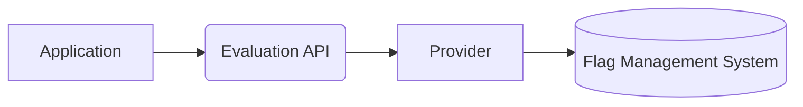

# 2. Provider

[](https://github.com/open-feature/spec/tree/main/specification#hardening)

## Overview

The `provider` API defines interfaces that Provider Authors can use to abstract a particular flag management system, thus enabling the use of the `evaluation API` by Application Authors.

Providers are the "translator" between the flag evaluation calls made in application code, and the flag management system that stores flags and in some cases evaluates flags. At a minimum, providers should implement some basic evaluation methods which return flag values of the expected type. In addition, providers may transform the [evaluation context](./03-evaluation-context.md) appropriately in order to be used in dynamic evaluation of their associated flag management system, provide insight into why evaluation proceeded the way it did, and expose configuration options for their associated flag management system. Hypothetical provider implementations might wrap a vendor SDK, embed an REST client, or read flags from a local file.



### 2.1. Feature Provider Interface

#### Requirement 2.1.1

> The provider interface **MUST** define a `metadata` member or accessor, containing a `name` field or accessor of type string, which identifies the provider implementation.

```typescript
provider.getMetadata().getName(); // "my-custom-provider"
```

### 2.2 Flag Value Resolution

`Providers` are implementations of the `feature provider` interface, which may wrap vendor SDKs, REST API clients, or otherwise resolve flag values from the runtime environment.

#### Requirement 2.2.1

> The `feature provider` interface **MUST** define methods to resolve flag values, with parameters `flag key` (string, required), `default value` (boolean | number | string | structure, required) and `evaluation context` (optional), which returns a `resolution details` structure.

```typescript
// example flag resolution function
resolveBooleanValue(flagKey, defaultValue, context);
```

see: [flag resolution structure](../types.md#resolution-details), [flag value resolution](../glossary.md#resolving-flag-values)

#### Condition 2.2.2

> The implementing language type system differentiates between strings, numbers, booleans and structures.

##### Conditional Requirement 2.2.2.1

> The `feature provider` interface **MUST** define methods for typed flag resolution, including boolean, numeric, string, and structure.

```typescript
// example boolean flag value resolution
ResolutionDetails resolveBooleanValue(string flagKey, boolean defaultValue, context: EvaluationContext);

// example string flag value resolution
ResolutionDetails resolveStringValue(string flagKey, string defaultValue, context: EvaluationContext);

// example number flag value resolution
ResolutionDetails resolveNumberValue(string flagKey, number defaultValue, context: EvaluationContext);

// example structure flag value resolution
ResolutionDetails resolveStructureValue(string flagKey, JsonObject defaultValue, context: EvaluationContext);
```

#### Requirement 2.2.3

> In cases of normal execution, the `provider` **MUST** populate the `resolution details` structure's `value` field with the resolved flag value.

#### Requirement 2.2.4

> In cases of normal execution, the `provider` **SHOULD** populate the `resolution details` structure's `variant` field with a string identifier corresponding to the returned flag value.

For example, the flag value might be `3.14159265359`, and the variant field's value might be `"pi"`.

The value of the variant field might only be meaningful in the context of the flag management system associated with the provider. For example, the variant may be a UUID corresponding to the variant in the flag management system, or an index corresponding to the variant in the flag management system.

#### Requirement 2.2.5

> The `provider` **SHOULD** populate the `resolution details` structure's `reason` field with `"STATIC"`, `"DEFAULT",` `"TARGETING_MATCH"`, `"SPLIT"`, `"CACHED"`, `"DISABLED"`, `"UNKNOWN"`, `"STALE"`, `"ERROR"` or some other string indicating the semantic reason for the returned flag value.

As indicated in the definition of the [`resolution details`](../types.md#resolution-details) structure, the `reason` should be a string. This allows providers to reflect accurately why a flag was resolved to a particular value.

#### Requirement 2.2.6

> In cases of normal execution, the `provider` **MUST NOT** populate the `resolution details` structure's `error code` field, or otherwise must populate it with a null or falsy value.

#### Requirement 2.2.7

> In cases of abnormal execution, the `provider` **MUST** indicate an error using the idioms of the implementation language, with an associated `error code` and optional associated `error message`.

The provider might throw an exception, return an error, or populate the `error code` object on the returned `resolution details` structure to indicate a problem during flag value resolution.

See [error code](../types.md#error-code) for details.

```typescript
// example throwing an exception with an error code and optional error message.
throw new ProviderError(ErrorCode.INVALID_CONTEXT, "The 'foo' attribute must be a string.");
```

#### Condition 2.2.8

> The implementation language supports generics (or an equivalent feature).

##### Conditional Requirement 2.2.8.1

> The `resolution details` structure **SHOULD** accept a generic argument (or use an equivalent language feature) which indicates the type of the wrapped `value` field.

```typescript
// example boolean flag value resolution with generic argument
ResolutionDetails<boolean> resolveBooleanValue(string flagKey, boolean defaultValue, context: EvaluationContext);

// example string flag value resolution with generic argument
ResolutionDetails<string> resolveStringValue(string flagKey, string defaultValue, context: EvaluationContext);

// example number flag value resolution with generic argument
ResolutionDetails<number> resolveNumberValue(string flagKey, number defaultValue, context: EvaluationContext);

// example structure flag value resolution with generic argument
ResolutionDetails<MyStruct> resolveStructureValue(string flagKey, MyStruct defaultValue, context: EvaluationContext);
```
##### Requirement 2.2.9

> The `provider` **SHOULD** populate the `resolution details` structure's `flag metadata` field.

##### Requirement 2.2.10

> `flag metadata` **MUST** be a structure supporting the definition of arbitrary properties, with keys of type `string`, and values of type `boolean | string | number`.

### 2.3. Provider hooks

A `provider hook` exposes a mechanism for `provider authors` to register [`hooks`](./04-hooks.md) to tap into various stages of the flag evaluation lifecycle. These hooks can be used to perform side effects and mutate the context for purposes of the provider. Provider hooks are not configured or controlled by the `application author`.

#### Requirement 2.3.1

> The provider interface **MUST** define a `provider hook` mechanism which can be optionally implemented in order to add `hook` instances to the evaluation life-cycle.

```java
class MyProvider implements Provider {
  //...

  readonly hooks: Hook[] = [new MyProviderHook()];

  // ..or alternatively..
  getProviderHooks(): Hook[]  {
    return [new MyProviderHook()];
  }

  //...
}
```

#### Requirement 2.3.2

> In cases of normal execution, the `provider` **MUST NOT** populate the `resolution details` structure's `error message` field, or otherwise must populate it with a null or falsy value.

#### Requirement 2.3.3

> In cases of abnormal execution, the `resolution details` structure's `error message` field **MAY** contain a string containing additional detail about the nature of the error.

### 2.4 Initialization

[](https://github.com/open-feature/spec/tree/main/specification#experimental)

#### Requirement 2.4.1

> The `provider` **MAY** define an initialization function which accepts the global `evaluation context` as an argument and performs initialization logic relevant to the provider.

Many feature flag frameworks or SDKs require some initialization before they can be used.
They might require the completion of an HTTP request, establishing persistent connections, or starting timers or worker threads.
The initialization function is an ideal place for such logic.

```java
// MyProvider implementation of the initialize function defined in Provider
class MyProvider implements Provider {
  //...

  // the global context is passed to the initialization function
  void initialize(EvaluationContext initialContext) {
    /*
      A hypothetical initialization function: make an initial call doing some bulk initial evaluation, start a worker to do periodic updates
    */
    this.flagCache = this.restClient.bulkEvaluate(initialContext);
    this.startPolling();
  }

  //...
}
```

#### Condition 2.4.2

> The provider defines an `initialize` function.

##### Conditional Requirement 2.4.2.1

> If the provider's `initialize` function fails to render the provider ready to evaluate flags, it **SHOULD** abnormally terminate.

If a provider is unable to start up correctly, it should indicate abnormal execution by throwing an exception, returning an error, or otherwise indicating so by means idiomatic to the implementation language.
If the error is irrecoverable (perhaps due to bad credentials or invalid configuration) the `PROVIDER_FATAL` error code should be used.

see: [error codes](../types.md#error-code)

### 2.5. Shutdown

[](https://github.com/open-feature/spec/tree/main/specification#experimental)

#### Requirement 2.5.1

> The provider **MAY** define a mechanism to gracefully shutdown and dispose of resources.

```java
// MyProvider implementation of the dispose function defined in Provider
class MyProvider implements Provider, AutoDisposable {
  //...
  void dispose() {
    // close connections, terminate threads or timers, etc...
  }
```

#### Requirement 2.5.2

> After a provider's shutdown function has terminated successfully, the provider's state **MUST** revert to its uninitialized state.

If a provider requires initialization, once it's shut down, it must transition to its initial `NOT_READY` state. Some providers may allow reinitialization from this state.
Providers not requiring initialization are assumed to be ready at all times.

see: [initialization](#24-initialization)

### 2.6. Provider context reconciliation

[](https://github.com/open-feature/spec/tree/main/specification#experimental)

Static-context focused providers may need a mechanism to understand when their cache of evaluated flags must be invalidated or updated. An `on context changed` function can be defined which performs whatever operations are needed to reconcile the evaluated flags with the new context.

#### Requirement 2.6.1

> The provider **MAY** define an `on context changed` function, which takes an argument for the previous context and the newly set context, in order to respond to an evaluation context change.

Especially in static-context implementations, providers and underlying SDKs may maintain state for a particular context.
The `on context changed` function provides a mechanism to update this state, often by re-evaluating flags in bulk with respect to the new context.

```java
// MyProvider implementation of the onContextChanged function defined in Provider
class MyProvider implements Provider {
  //...

  onContextChanged(EvaluationContext oldContext, EvaluationContext newContext): void {
    // update context-sensitive cached flags, or otherwise react to the change in the global context
  }

  //...
}
```

Providers may maintain remote connections, timers, threads or other constructs that need to be appropriately disposed of.
Provider authors may implement a `shutdown` function to perform relevant clean-up actions.
Alternatively, implementations might leverage language idioms such as auto-disposable interfaces or some means of cancellation signal propagation to allow for graceful shutdown.

### 2.7. Tracking Support

[](https://github.com/open-feature/spec/tree/main/specification#experimental)

Some flag management systems support tracking functionality, which associates feature flag evaluations with subsequent user actions or application state.

See [tracking](./06-tracking.md).

#### Condition 2.7.1

> The `provider` **MAY** define a function for tracking the occurrence of a particular user action or application state, with parameters `occurrence key` (string, required), `evaluation context` (optional) and `occurrence details` (optional) which returns nothing.

```java
class MyProvider implements Tracking {
  //...

  /**
   * Record a tracking occurrence.
   */
  void track(String occurrenceKey, OccurrenceDetails details, EvaluationContext context): void;
  
  //...
}
```

The track function is a void function (function returning nothing).
The track function performs side effects required to record the `occurrence` in question, which may include network activity or other I/O; this I/O should not block the function call.
Providers should be careful to complete any communication or flush any relevant uncommitted tracking data before they shut down.

See [shutdown](#25-shutdown).