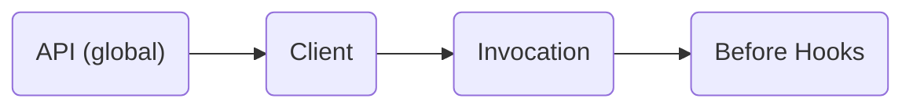

# 3. Evaluation Context

## Overview

The `evaluation context` provides ambient information for the purposes of flag evaluation. Contextual data may be used as the basis for targeting, including rule-based evaluation, overrides for specific subjects, or fractional flag evaluation.

The context might contain information about the end-user, the application, the host, or any other ambient data that might be useful in flag evaluation. For example, a flag system might define rules that return a specific value based on the user's email address, locale, or the time of day. The context provides this information. The context can be optionally provided at evaluation, and mutated in [before hooks](./04-hooks.md).

### 3.1 Fields

> [!NOTE]
> Field casing is not specified, and should be chosen in accordance with language idioms.

see: [types](../types.md)

#### Requirement 3.1.1

> The `evaluation context` structure **MUST** define an optional `targeting key` field of type string, identifying the subject of the flag evaluation.

The targeting key uniquely identifies the subject (end-user, or client service) of a flag evaluation. Providers may require this field for fractional flag evaluation, rules, or overrides targeting specific users. Such providers may behave unpredictably if a targeting key is not specified at flag resolution.

#### Requirement 3.1.2

> The evaluation context **MUST** support the inclusion of custom fields, having keys of type `string`, and values of type `boolean | string | number | datetime | structure`.

see: [structure](../types.md#structure), [datetime](../types.md#datetime)

#### Requirement 3.1.3

> The evaluation context **MUST** support fetching the custom fields by key and also fetching all key value pairs.

#### Requirement 3.1.4

> The evaluation context fields **MUST** have an unique key.

The key uniquely identifies a field in the `evaluation context` and it should be unique across all types to avoid any collision when marshalling the `evaluation context` by the provider.

### 3.2 Context levels and merging

#### Condition 3.2.1

> The implementation uses the dynamic-context paradigm.

see: [dynamic-context paradigm](../glossary.md#dynamic-context-paradigm)

##### Conditional Requirement 3.2.1.1

> The API, Client and invocation **MUST** have a method for supplying `evaluation context`.

API (global) `evaluation context` can be used to supply static data to flag evaluation, such as an application identifier, compute region, or hostname. Client and invocation `evaluation context` are ideal for dynamic data, such as end-user attributes.

#### Condition 3.2.2

> The implementation uses the static-context paradigm.

see: [static-context paradigm](../glossary.md#static-context-paradigm)

##### Conditional Requirement 3.2.2.1

> The API **MUST** have a method for setting the global `evaluation context`.

API (global) `evaluation context` can be used to supply data to flag evaluation, such as (but not limited to) user name, email, or user organization membership changes.

##### Conditional Requirement 3.2.2.2

> The Client and invocation **MUST NOT** have a method for supplying `evaluation context`.

In the static-context paradigm, context is global. The client and invocation cannot supply evaluation context.

##### Conditional Requirement 3.2.2.3

> The API **MUST** have a method for setting `evaluation context` for a `domain`.

In the static-context paradigm, provider specific context can be set using the associated `domain`.
The global context is used if there is no matching provider specific context.

See [setting a provider](./01-flag-evaluation.md#setting-a-provider), [domain](../glossary.md#domain) for details.

##### Conditional Requirement 3.2.2.4

> The API **MUST** have a mechanism to manage `evaluation context` for an associated `domain`.

In the static-context paradigm, it must be possible to create and remove provider-specific context.
See [setting a provider](./01-flag-evaluation.md#setting-a-provider), [domain](../glossary.md#domain) for details.

#### Requirement 3.2.3

> Evaluation context **MUST** be merged in the order: API (global; lowest precedence) -> client -> invocation -> before hooks (highest precedence), with duplicate values being overwritten.

Any fields defined in the client `evaluation context` will overwrite duplicate fields defined globally, and fields defined in the invocation `evaluation context` will overwrite duplicate fields defined globally or on the client. Any resulting `evaluation context` from a [before hook](./04-hooks.md#requirement-434) will overwrite duplicate fields defined globally, on the client, or in the invocation.

#### Condition 3.2.4

> The implementation uses the static-context paradigm.

see: [static-context paradigm](../glossary.md#static-context-paradigm)

##### Conditional Requirement 3.2.4.1

> When the global `evaluation context` is set, the `on context changed` handler **MUST** run.

The SDK implementation must run the `on context changed` handler on all registered provider that use the global `evaluation context` whenever it is mutated.

##### Conditional Requirement 3.2.4.2

> When the `evaluation context` for a specific provider is set, the `on context changed` handler **MUST** only run on the associated provider.

The SDK implementation must run the `on context changed` handler only on the provider that is scoped to the mutated `evaluation context`.