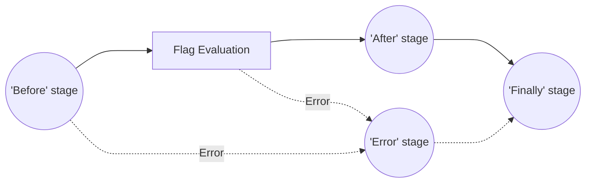
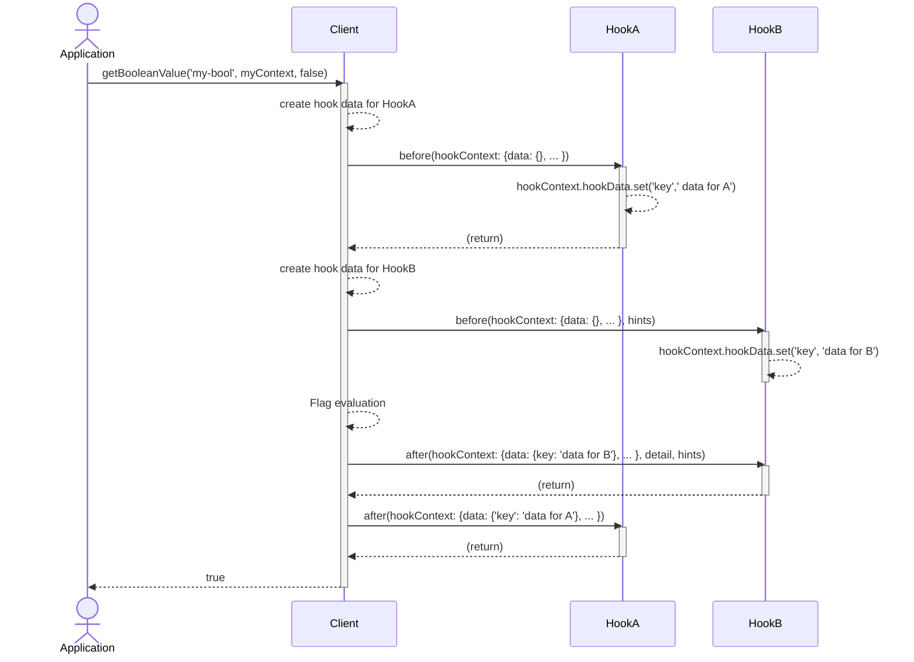

# 4. Hooks

[](https://github.com/open-feature/spec/tree/main/specification#hardening)

## Overview

`Hooks` are a mechanism whereby application developers can add arbitrary behavior to flag evaluation. They operate similarly to middleware in many web frameworks.

Hooks add their logic at any of four specific stages of flag evaluation:

- `before`, immediately before flag evaluation
- `after`, immediately after successful flag evaluation
- `error`, immediately after an unsuccessful flag evaluation
- `finally`, unconditionally after flag evaluation



Hooks can be configured to run globally (impacting all flag evaluations), per client, or per flag evaluation invocation. Some example use cases for a hook include adding additional data to the [evaluation context](./03-evaluation-context.md), performing validation on the received flag value, providing data to telemetric tools, and logging errors.

### Definitions

**Hook**: Application author/integrator-supplied logic that is called by the OpenFeature framework at a specific stage.

**Stage**: An explicit portion of the flag evaluation lifecycle. e.g. `before` being "before the [resolution](../glossary.md#resolving-flag-values) is run.

**Invocation**: A single call to evaluate a flag. `client.getBooleanValue(..)` is an invocation.

**API**: The global API singleton.

### 4.1. Hook context

Hook context exists to provide hooks with information about the invocation and propagate data between hook stages.

#### Requirement 4.1.1

> Hook context **MUST** provide: the `flag key`, `flag value type`, `evaluation context`, `default value`, and `hook data`.

#### Requirement 4.1.2

> The `hook context` **SHOULD** provide access to the `client metadata` and the `provider metadata` fields.

#### Requirement 4.1.3

> The `flag key`, `flag type`, and `default value` properties **MUST** be immutable. If the language does not support immutability, the hook **MUST NOT** modify these properties.

#### Condition 4.1.4

> The implementation uses the dynamic-context paradigm.

see: [dynamic-context paradigm](../glossary.md#dynamic-context-paradigm)

##### Conditional Requirement 4.1.4.1

> The evaluation context **MUST** be mutable only within the `before` hook.

#### Requirement 4.1.5

> The `hook data` **MUST** be mutable.

Either the `hook data` reference itself must be mutable, or it must allow mutation of its contents.

Mutable reference:
```
hookContext.hookData = {'my-key': 'my-value'}
```

Mutable content:
```
hookContext.hookData.set('my-key', 'my-value')
```

### 4.2. Hook Hints

#### Requirement 4.2.1

> `hook hints` **MUST** be a structure supports definition of arbitrary properties, with keys of type `string`, and values of type `boolean | string | number | datetime | structure`.

#### Condition 4.2.2

> The implementation language supports a mechanism for marking data as immutable.

##### Conditional Requirement 4.2.2.1

> Condition: `Hook hints` **MUST** be immutable.

##### Conditional Requirement 4.2.2.2

> Condition: The client `metadata` field in the `hook context` **MUST** be immutable.

##### Conditional Requirement 4.2.2.3

> Condition: The provider `metadata` field in the `hook context` **MUST** be immutable.

### 4.3. Hook creation and parameters

#### Requirement 4.3.1

> Hooks **MUST** specify at least one stage.

#### Requirement 4.3.2

> `Hook data` **MUST** must be created before the first `stage` invoked in a hook for a specific evaluation and propagated between each `stage` of the hook. The hook data is not shared between different hooks.

Example showing data between `before` and `after` stage for two different hooks.


#### Condition 4.3.2

> The implementation uses the dynamic-context paradigm.

see: [dynamic-context paradigm](../glossary.md#dynamic-context-paradigm)

##### Conditional Requirement 4.3.2.1

> The `before` stage **MUST** run before flag resolution occurs. It accepts a `hook context` (required) and `hook hints` (optional) as parameters and returns either an `evaluation context` or nothing.

```java
EvaluationContext | void before(HookContext hookContext, HookHints hints);
```

#### Condition 4.3.3

[](https://github.com/open-feature/spec/tree/main/specification#hardening)

> The implementation uses the static-context paradigm.

see: [static-context paradigm](../glossary.md#static-context-paradigm)

##### Conditional Requirement 4.3.3.1

> The `before` stage **MUST** run before flag resolution occurs. It accepts a `hook context` (required) and `hook hints` (optional) as parameters. It has no return value.

```java
void before(HookContext hookContext, HookHints hints);
```

#### Requirement 4.3.4

> Any `evaluation context` returned from a `before` hook **MUST** be passed to subsequent `before` hooks (via `HookContext`).

#### Requirement 4.3.5

> When `before` hooks have finished executing, any resulting `evaluation context` **MUST** be merged with the existing `evaluation context`.

Evaluation context merge order is defined in [Context levels and merging](./03-evaluation-context.md#32-context-levels-and-merging).

#### Requirement 4.3.6

> The `after` stage **MUST** run after flag resolution occurs. It accepts a `hook context` (required), `evaluation details` (required) and `hook hints` (optional). It has no return value.

#### Requirement 4.3.7

> The `error` hook **MUST** run when errors are encountered in the `before` stage, the `after` stage or during flag resolution. It accepts `hook context` (required), `exception` representing what went wrong (required), and `hook hints` (optional). It has no return value.

#### Requirement 4.3.8

> The `finally` hook **MUST** run after the `before`, `after`, and `error` stages. It accepts a `hook context` (required), `evaluation details` (required) and `hook hints` (optional). It has no return value.

The evaluation details passed to the `finally` stage matches the evaluation details returned to the application author.

#### Condition 4.3.9

> `finally` is a reserved word in the language.

##### Conditional Requirement 4.3.9.1

> Instead of `finally`, `finallyAfter` **SHOULD** be used.

### 4.4. Hook registration & ordering

#### Requirement 4.4.1

> The API, Client, Provider, and invocation **MUST** have a method for registering hooks.

```js
OpenFeature.addHooks(new Hook1());

//...

Client client = OpenFeature.getClient();
client.addHooks(new Hook2());
`
//...

client.getValue('my-flag', 'defaultValue', new Hook3());
```

#### Requirement 4.4.2

> Hooks **MUST** be executed "stack-wise" with respect to flag resolution, prioritizing increasing specificity (API, Client, Invocation, Provider) first, and the order in which they were added second.

Before flag resolution (the `before` stage), hooks run in the order `API` -> `Client` -> `Invocation` -> `Provider`, and within those, in the order in which they were added. 
After flag evaluation (the `after`, `error`, or `finally` stages), hooks run in the order `Provider` -> `Invocation` -> `Client` -> `API`, and within those, in reverse of the order in which they were added.
This achieves intuitive "stack-like" or "LIFO" behavior for side effects and transformations.

```
Given hooks A - H, each implementing the both the `before` and `after` stages, added at the following levels and order:

API: [A, B]
Client: [C, D]
Invocation: [E, F]
Provider: [G, H]

The expected order of execution is:

A.before -> B.before -> C.before -> D.before -> E.before -> F.before -> G.before -> H.before -> flagResolution -> H.after -> G.after -> F.after -> E.after -> D.after -> C.after -> B.after -> A.after
```

#### Requirement 4.4.3

> If a `finally` hook abnormally terminates, evaluation **MUST** proceed, including the execution of any remaining `finally` hooks.

In languages with try/catch semantics, this means that exceptions thrown in `finally` hooks should be caught and not propagated up the call stack.

#### Requirement 4.4.4

> If an `error` hook abnormally terminates, evaluation **MUST** proceed, including the execution of any remaining `error` hooks.

In languages with try/catch semantics, this means that exceptions thrown in `error` hooks should be caught, and not propagated up the call stack.

#### Requirement 4.4.5

> If an error occurs in the `before` or `after` hooks, the `error` hooks **MUST** be invoked.

#### Requirement 4.4.6

> If an error occurs during the evaluation of `before` or `after` hooks, any remaining hooks in the `before` or `after` stages **MUST NOT** be invoked.

#### Requirement 4.4.7

> If an error occurs in the `before` hooks, the default value **MUST** be returned.

Before hooks can impact evaluation by various means, such as mutating the `evaluation context`. Therefore, an error in the `before` hooks is considered abnormal execution, and the default should be returned.

### [Flag evaluation options](../types.md#evaluation-options)

Usage might look something like:

```python
val = client.get_boolean_value('my-key', False, evaluation_options={
    'hooks': new MyHook(),
    'hook_hints': {'side-item': 'onion rings'}
})
```

see: [Flag evaluation options](./01-flag-evaluation.md#evaluation-options)

#### Requirement 4.5.1

> `Flag evaluation options` **MAY** contain `hook hints`, a map of data to be provided to hook invocations.

#### Requirement 4.5.2

> `hook hints` **MUST** be passed to each hook.

#### Requirement 4.5.3

> The hook **MUST NOT** alter the `hook hints` structure.

### 4.6. Hook data

Hook data exists to allow hook stages to share data for a specific evaluation. For instance a span
for OpenTelemetry could be created in a `before` stage and closed in an `after` stage.

Hook data is scoped to a specific hook instance. The different stages of a hook share the same data,
but different hooks have different hook data instances.

```Java
  public Optional<EvaluationContext> before(HookContext context, HookHints hints) {
    SpanBuilder builder = tracer.spanBuilder('sample')
    .setParent(Context.current().with(Span.current()));
    Span span = builder.startSpan()
    context.hookData.set("span", span);
  }

  public void after(HookContext context, FlagEvaluationDetails details, HookHints hints) {
    // Only accessible by this hook for this specific evaluation.
    Object value = context.hookData.get("span");
    if (value instanceof Span) {
      Span span = (Span) value;
      span.end();
    }
  }
```

#### Requirement 4.6.1

> `hook data` **MUST** be a structure supporting the definition of arbitrary properties, with keys of type `string`, and values of any type.

Access to hook data is restricted to only a single hook instance, and it has no serialization requirements, and as a result does not require any value type restrictions.

Example TypeScript definition:
```JavaScript
type HookData = Record<string, unknown>;
```
