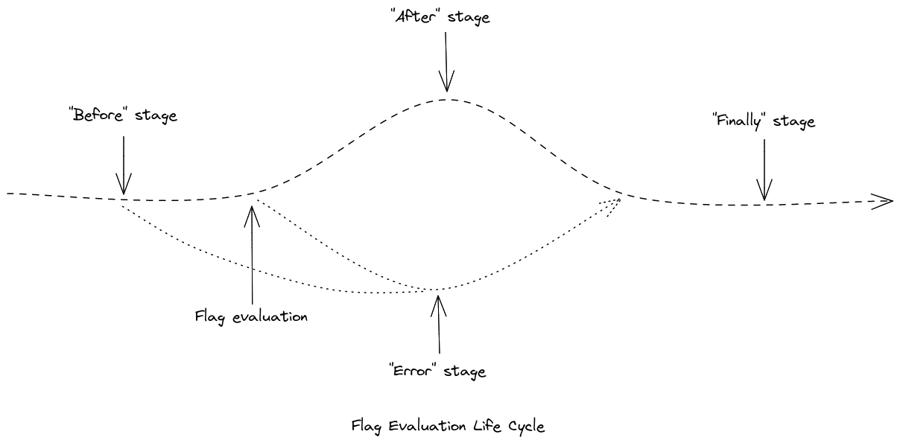

# Hooks

## Overview

`Hooks` are a mechanism whereby application developers can add arbitrary behavior to flag evaluation. They operate similarly to middleware in many web frameworks.

Hooks add their logic at any of four specific stages of flag evaluation:

- `before`, immediately before flag evaluation
- `after`, immediately after successful flag evaluation
- `error`, immediately after an unsuccessful during flag evaluation
- `finally` unconditionally after flag evaluation



Hooks can be configured to run globally (impacting all flag evaluations), per client, or per flag evaluation invocation. Some example use-cases for hook include adding additional data to the [evaluation context](./03-evaluation-context.md), performing validation on the received flag value, providing data to telemetric tools, and logging errors.

### Definitions

**Hook**: Application author/integrator-supplied logic that is called by the OpenFeature framework at a specific stage. **Stage**: An explicit portion of the flag evaluation lifecycle. e.g. `before` being "before the [resolution](../glossary.md#resolving-flag-values) is run. **Invocation**: A single call to evaluate a flag. `client.getBooleanValue(..)` is an invocation. **API**: The global API singleton.

### Hook context

Hook context exists to provide hooks with information about the invocation.

#### Requirement 4.1.1

> Hook context **MUST** provide: the `flag key`, `flag value type`, `evaluation context`, and the `default value`.

#### Requirement 4.1.2

> The `hook context` **SHOULD** provide: access to the `client metadata` and the `provider metadata` fields.

#### Requirement 4.1.3

> The `flag key`, `flag type`, and `default value` properties **MUST** be immutable. If the language does not support immutability, the hook **MUST NOT** modify these properties.

#### Requirement 4.1.4

> The evaluation context **MUST** be mutable only within the `before` hook.

### Hook Hints

#### Requirement 4.2.1

> `hook hints` **MUST** be a structure supports definition of arbitrary properties, with keys of type `string`, and values of type `boolean | string | number | datetime | structure`..

#### Condition 4.2.2

> The implementation language supports a mechanism for marking data as immutable.

##### Conditional Requirement 4.2.2.1

> Condition: `Hook hints` **MUST** be immutable.

##### Conditional Requirement 4.2.2.2

> Condition: The client `metadata` field in the `hook context` **MUST** be immutable.

##### Conditional Requirement 4.2.2.3

> Condition: The provider `metadata` field in the `hook context` **MUST** be immutable.

### Hook creation and parameters

#### Requirement 4.3.1

> Hooks **MUST** specify at least one stage.

#### Requirement 4.3.2

> The `before` stage **MUST** run before flag resolution occurs. It accepts a `hook context` (required) and `hook hints` (optional) as parameters and returns either an `evaluation context` or nothing.

```typescript
EvaluationContext | void before(HookContext, HookHints);
```

#### Requirement 4.3.3

> Any `evaluation context` returned from a `before` hook **MUST** be passed to subsequent `before` hooks (via `HookContext`).

#### Requirement 4.3.4

> When `before` hooks have finished executing, any resulting `evaluation context` **MUST** be merged with the invocation `evaluation context` with the invocation `evaluation context` taking precedence in the case of any conflicts.

#### Requirement 4.3.5

> The `after` stage **MUST** run after flag resolution occurs. It accepts a `hook context` (required), `flag evaluation details` (required) and `hook hints` (optional). It has no return value.

#### Requirement 4.3.6

> The `error` hook **MUST** run when errors are encountered in the `before` stage, the `after` stage or during flag resolution. It accepts `hook context` (required), `exception` representing what went wrong (required), and `hook hints` (optional). It has no return value.

#### Requirement 4.3.7

> The `finally` hook **MUST** run after the `before`, `after`, and `error` stages. It accepts a `hook context` (required) and `hook hints` (optional). There is no return value.

#### Condition 4.3.8

> `finally` is a reserved word in the language.

##### Conditional Requirement 4.3.8.1

> Instead of `finally`, `finallyAfter` **SHOULD** be used.

### Hook registration & ordering

#### Requirement 4.4.1

> The API, Client and invocation **MUST** have a method for registering hooks which accepts `flag evaluation options`

```js
OpenFeature.addHooks(new Hook1());

//...

Client client = OpenFeature.getClient();
client.addHooks(new Hook2());
`
//...

client.getValue('my-flag', 'defaultValue', new Hook3());
```

#### Requirement 4.4.2

> Hooks **MUST** be evaluated in the following order:
>
> - before: API, Client, Invocation, Provider
> - after: Provider, Invocation, Client, API
> - error (if applicable): Provider, Invocation, Client, API
> - finally: Provider, Invocation, Client, API

#### Requirement 4.4.3

> If a `finally` hook abnormally terminates, evaluation **MUST** proceed, including the execution of any remaining `finally` hooks.

In languages with try/catch semantics, this means that exceptions thrown in `finally` hooks should be caught, and not propagated up the call stack.

#### Requirement 4.4.4

> If an `error` hook abnormally terminates, evaluation **MUST** proceed, including the execution of any remaining `error` hooks.

In languages with try/catch semantics, this means that exceptions thrown in `error` hooks should be caught, and not propagated up the call stack.

#### Requirement 4.4.5

> If an error occurs in the `before` or `after` hooks, the `error` hooks **MUST** be invoked.

#### Requirement 4.4.6

> If an error occurs during the evaluation of `before` or `after` hooks, any remaining hooks in the `before` or `after` stages **MUST NOT** be invoked.

#### Requirement 4.4.7

> If an error occurs in the `before` hooks, the default value **MUST** be returned.

Before hooks can impact evaluation by various means, such as mutating the `evaluation context`. Therefore, an error in the `before` hooks is considered abnormal execution, and the default should be returned.

### [Flag evaluation options](../types.md#evaluation-options)

Usage might look something like:

```python
val = client.get_boolean_value('my-key', False, evaluation_options={
    'hooks': new MyHook(),
    'hook_hints': {'side-item': 'onion rings'}
})
```

See: [Flag evaluation options](./01-flag-evaluation.md#)

#### Requirement 4.5.1

> `Flag evaluation options` **MAY** contain `hook hints`, a map of data to be provided to hook invocations.

#### Requirement 4.5.2

> `hook hints` **MUST** be passed to each hook.

#### Requirement 4.5.3

> The hook **MUST NOT** alter the `hook hints` structure.
