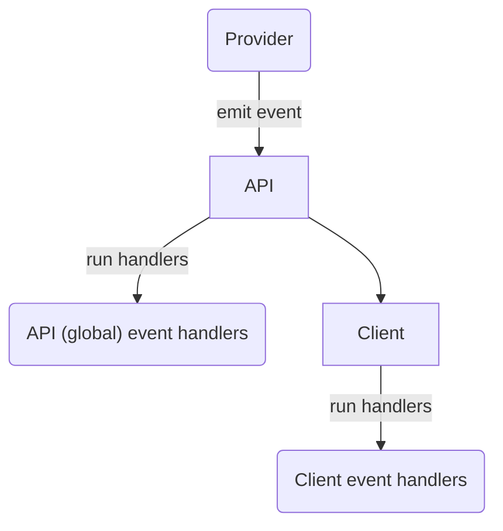
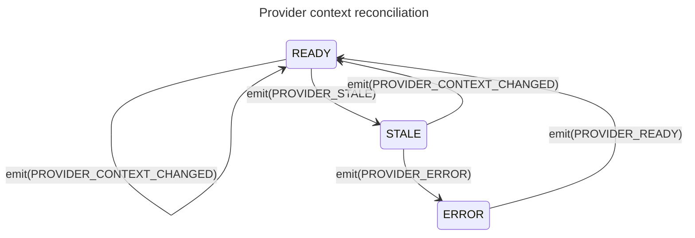

# 5. Events

[](https://github.com/open-feature/spec/tree/main/specification#experimental)

## Overview

`Events` allow consumers (_application integrator_, _application author_, _integration author_) to react to state changes in the provider or underlying flag management system, such as flag definition changes, provider readiness, or error conditions. A provider may emit events or run a callback indicating that it received a certain event, optionally providing data associated with that event. Handlers registered on the `client` or the global `API` are then invoked with this data.

The data that providers supply in event payloads may include a list of `flag keys` changed, error messages, and possibly updated flag values.



### 5.1. Provider events

#### Requirement 5.1.1

> The `provider` **MAY** define a mechanism for signaling the occurrence of one of a set of events, including `PROVIDER_READY`, `PROVIDER_ERROR`, `PROVIDER_CONFIGURATION_CHANGED` and `PROVIDER_STALE`, with a `provider event details` payload. 

If available, native event-emitter or observable/observer language constructs can be used.

see: [provider event types](../types.md#provider-events), [`event details`](../types.md#provider-event-details).

#### Requirement 5.1.2

> When a `provider` signals the occurrence of a particular `event`, the associated `client` and `API` event handlers **MUST** run.

see: [provider event types](./../types.md#provider-events) and [event handlers](#52-event-handlers).

#### Requirement 5.1.3

> When a `provider` signals the occurrence of a particular `event`, event handlers on clients which are not associated with that provider **MUST NOT** run.

Providers bound to a `domain` constitute their own "events scope".

see [setting a provider](./01-flag-evaluation.md#setting-a-provider), [domain](../glossary.md#domain) for details.

#### Requirement 5.1.4

> `PROVIDER_ERROR` events **SHOULD** populate the `provider event details`'s `error message` field.

The error message field should contain an informative message as to the nature of the error.

See [event metadata](../types.md#provider-event-details)

### 5.2. Event handlers

#### Requirement 5.2.1

> The `client` **MUST** provide a function for associating `handler functions` with a particular `provider event type`.

```java
  // run the myClientOnReadyHandler function when the PROVIDER_READY event is fired
  client.addHandler(ProviderEvents.Ready, myClientOnReadyHandler);
```

see: [provider events](#51-provider-events), [`provider event types`](../types.md#provider-events)

#### Requirement 5.2.2

> The `API` **MUST** provide a function for associating `handler functions` with a particular `provider event type`.

```java
  // run the myGlobalErrorHandler function when the PROVIDER_READY event is fired
  OpenFeature.addHandler(ProviderEvents.Error, myGlobalErrorHandler);
```

see: [provider events](#51-provider-events), [`provider event types`](../types.md#provider-events)

#### Requirement 5.2.3

> The `event details` **MUST** contain the `provider name` associated with the event.

The `provider name` indicates the provider from which the event originated.
This is especially relevant for global event handlers used for general monitoring, such as alerting on provider errors.

See [setting a provider](./01-flag-evaluation.md#setting-a-provider), [creating clients](./01-flag-evaluation.md#creating-clients).

#### Requirement 5.2.4

> The `handler function` **MUST** accept a `event details` parameter.

see: [`event details`](../types.md#event-details)

#### Requirement 5.2.5

> If a `handler function` terminates abnormally, other `handler functions` **MUST** run.

#### Requirement 5.2.6

> Event handlers **MUST** persist across `provider` changes.

If the underlying provider is changed, existing client and API event handlers will still fire.
This means that the order of provider configuration and event handler addition is independent.

#### Requirement 5.2.7

> The `API` and `client` **MUST** provide a function allowing the removal of event handlers.

```java
  // remove an existing handler for a PROVIDER_CONFIGURATION_CHANGED event
  client.removeHandler(ProviderEvents.ConfigurationChanged, myClientOnChangedHandler);
```

### Event handlers and initialization

Though providers themselves need not implement events, the `flag evaluation API` uses events to convey relevant state changes during configuration and initialization.
_Application authors_ and _application integrators_ use these events to wait for proper initialization of the provider and to do basic monitoring and error handling.

#### Requirement 5.3.1

> If the provider's `initialize` function terminates normally, `PROVIDER_READY` handlers **MUST** run.

See [provider initialization](./02-providers.md#24-initialization) and [setting a provider](./01-flag-evaluation.md#setting-a-provider).

#### Requirement 5.3.2

> If the provider's `initialize` function terminates abnormally, `PROVIDER_ERROR` handlers **MUST** run.

A failed initialization could represent an unrecoverable error, such as bad credentials or a missing file. 
If a failed initialization could also represent a transient error.
A provider which maintains a persistent connection to a remote `flag management system` may attempt to reconnect, and emit `PROVIDER_READY` after a failed initialization.

See [provider initialization](./02-providers.md#24-initialization) and [setting a provider](./01-flag-evaluation.md#setting-a-provider).

#### Requirement 5.3.3

> Handlers attached after the provider is already in the associated state, **MUST** run immediately.

Handlers may be attached at any point in the application lifecycle.
Handlers should run immediately if the provider is already in the associated state.
For instance, _application authors_ may attach readiness handlers to be confident that system is ready to evaluate flags.
If such handlers are attached after the provider underlying the client has already been initialized, they should run immediately.

See [provider initialization](./02-providers.md#24-initialization), [setting a provider](./01-flag-evaluation.md#setting-a-provider).

### Event handlers and context reconciliation

Providers built to conform to the static context paradigm feature an additional `PROVIDER_CONTEXT_CHANGED` event, which is used to signal that the global context has been changed, and flags should be re-evaluated.
This can be particularly useful for triggering UI repaints in multiple components when one component updates the [evaluation context](./03-evaluation-context.md).
SDK implementations automatically fire the the `PROVIDER_CONTEXT_CHANGED` events if the `on context changed` handler terminates normally (and `PROVIDER_ERROR` events otherwise).
Optionally, some providers may transition to the `STALE` state while their associated context is waiting to be reconciled, since this may involve asynchronous operations such as network calls.



#### Condition 5.3.4

[](https://github.com/open-feature/spec/tree/main/specification#experimental)

> The implementation uses the static-context paradigm.

see: [static-context paradigm](../glossary.md#static-context-paradigm)

##### Conditional Requirement 5.3.4.1

> When the provider's `on context changed` is called, the provider **MAY** emit the `PROVIDER_STALE` event, and transition to the `STALE` state.

Some providers cache evaluated flags, and re-evaluate them when the context is changed.
In these cases, the provider may signal its cache is invalid with the `PROVIDER_STALE` event and the `STALE` provider state.

see: [provider event types](../types.md#provider-events), [provider events](#51-provider-events), context, [provider context reconciliation](02-providers.md#26-provider-context-reconciliation)

##### Conditional Requirement 5.3.4.2

> If the provider's `on context changed` function terminates normally, associated `PROVIDER_CONTEXT_CHANGED` handlers **MUST** run.

The implementation must run any `PROVIDER_CONTEXT_CHANGED` handlers associated with the provider after the provider has reconciled its state and returned from the `on context changed` function.
The `PROVIDER_CONTEXT_CHANGED` is not emitted from the provider itself; the SDK implementation must run the `PROVIDER_CONTEXT_CHANGED` handlers if the `on context changed` function terminates normally.

see: [provider event types](../types.md#provider-events), [provider events](#51-provider-events), context, [provider context reconciliation](02-providers.md#26-provider-context-reconciliation)

##### Conditional Requirement 5.3.4.3

> If the provider's `on context changed` function terminates abnormally, associated `PROVIDER_ERROR` handlers **MUST** run.

The `PROVIDER_ERROR` is not emitted from the provider itself; the SDK implementation must run the `PROVIDER_ERROR` handlers if the `on context changed` throws or otherwise signals an error.

see: [provider event types](../types.md#provider-events), [provider events](#51-provider-events), context, [provider context reconciliation](02-providers.md#26-provider-context-reconciliation)