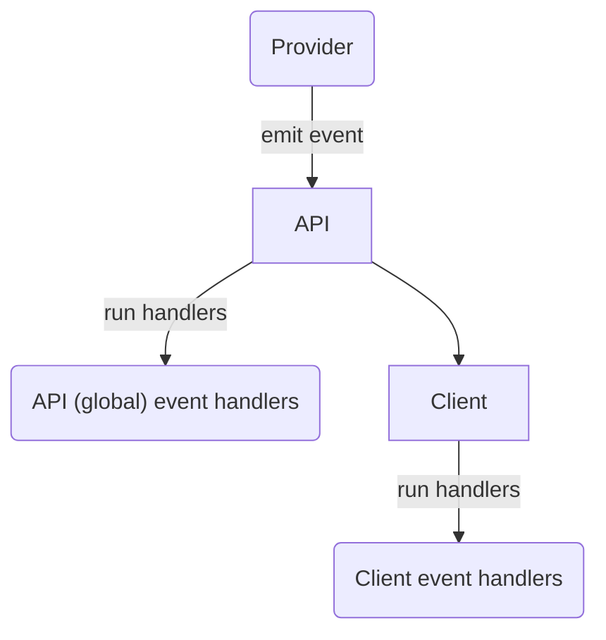
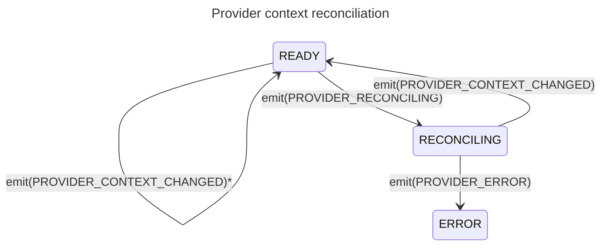

# 5. Events

[](https://github.com/open-feature/spec/tree/main/specification#experimental)

## Overview

`Events` allow consumers (_application integrator_, _application author_, _integration author_) to react to state changes in the provider or underlying flag management system, such as flag definition changes, provider readiness, or error conditions. A provider may emit events or run a callback indicating that it received a certain event, optionally providing data associated with that event. Handlers registered on the `client` or the global `API` are then invoked with this data.

The data that providers supply in event payloads may include a list of `flag keys` changed, error messages, and possibly updated flag values.



The `domain` of a provider constitutes a logical scope for events.
Clients associated with a particular provider through a `domain` run event handlers only when that provider emits events, or one of its lifecycle functions terminates.

see: [domain](../glossary.md#domain)

### 5.1. Provider events

#### Requirement 5.1.1

> The `provider` **MAY** define a mechanism for signaling the occurrence of one of a set of events, including `PROVIDER_READY`, `PROVIDER_ERROR`, `PROVIDER_CONFIGURATION_CHANGED` and `PROVIDER_STALE`, with a `provider event details` payload. 

Providers cannot emit `PROVIDER_CONTEXT_CHANGED` or `PROVIDER_RECONCILING` events.
These are emitted only by the SDK during context reconciliation.

If available, native event-emitter or observable/observer language constructs can be used.

When a provider is unable to evaluate flags (perhaps due to loss of connection with a remote service) the provider can signal this by emitting a `PROVIDER_ERROR` event.
When it recovers, it can emit a `PROVIDER_READY` event.
If the error state is irrecoverable, the `PROVIDER_FATAL` error code can be used.
If a provider caches rules-sets or previously evaluated flags, and such states cannot be considered up-to-date, the provider can signal this by emitting a `PROVIDER_STALE` event.

see: [provider event types](../types.md#provider-events), [`event details`](../types.md#provider-event-details), [events handlers and context reconciliation](#event-handlers-and-context-reconciliation)

#### Requirement 5.1.2

> When a `provider` signals the occurrence of a particular `event`, the associated `client` and `API` event handlers **MUST** run.

Client event handlers respect the dynamic binding of clients to providers via `domains`.
Client event handlers run when a lifecycle function terminates on the associated provider, or the associated provider emits an event. 

see: [provider event types](./../types.md#provider-events) and [event handlers](#52-event-handlers).

#### Requirement 5.1.3

> When a `provider` signals the occurrence of a particular `event`, event handlers on clients which are not associated with that provider **MUST NOT** run.

Client event handlers respect the dynamic binding of clients to providers via `domains`.
Client event handlers do not run when a lifecycle function terminates on an unassociated provider, or an unassociated provider emits an event. 

see [setting a provider](./01-flag-evaluation.md#setting-a-provider), [domain](../glossary.md#domain) for details.

#### Requirement 5.1.4

> `PROVIDER_ERROR` events **SHOULD** populate the `provider event details`'s `error message` field.

The error message field should contain an informative message as to the nature of the error.

See [event metadata](../types.md#provider-event-details)

#### Requirement 5.1.5

> `PROVIDER_ERROR` events **SHOULD** populate the `provider event details`'s `error code` field.

See [event metadata](../types.md#provider-event-details)

### 5.2. Event handlers

#### Requirement 5.2.1

> The `client` **MUST** provide a function for associating `handler functions` with a particular `provider event type`.

```java
  // run the myClientOnReadyHandler function when the PROVIDER_READY event is fired
  client.addHandler(ProviderEvents.Ready, myClientOnReadyHandler);
```

see: [provider events](#51-provider-events), [`provider event types`](../types.md#provider-events)

#### Requirement 5.2.2

> The `API` **MUST** provide a function for associating `handler functions` with a particular `provider event type`.

```java
  // run the myGlobalErrorHandler function when the PROVIDER_READY event is fired
  OpenFeature.addHandler(ProviderEvents.Error, myGlobalErrorHandler);
```

see: [provider events](#51-provider-events), [`provider event types`](../types.md#provider-events)

#### Requirement 5.2.3

> The `event details` **MUST** contain the `provider name` associated with the event.

The `provider name` indicates the provider from which the event originated.
This is especially relevant for global event handlers used for general monitoring, such as alerting on provider errors.

See [setting a provider](./01-flag-evaluation.md#setting-a-provider), [creating clients](./01-flag-evaluation.md#creating-clients).

#### Requirement 5.2.4

> The `handler function` **MUST** accept an `event details` parameter.

see: [`event details`](../types.md#event-details)

#### Requirement 5.2.5

> If a `handler function` terminates abnormally, other `handler functions` **MUST** run.

#### Requirement 5.2.6

> Event handlers **MUST** persist across `provider` changes.

If the underlying provider is changed, existing client and API event handlers will still fire.
This means that the order of provider configuration and event handler addition is independent.

#### Requirement 5.2.7

> The `API` and `client` **MUST** provide a function allowing the removal of event handlers.

```java
  // remove an existing handler for a PROVIDER_CONFIGURATION_CHANGED event
  client.removeHandler(ProviderEvents.ConfigurationChanged, myClientOnChangedHandler);
```

### Event handlers and initialization

Though providers themselves need not implement events, the `flag evaluation API` uses events to convey relevant state changes during configuration and initialization.
Implementations automatically emit `PROVIDER_READY` or `PROVIDER_ERROR` events depending on the outcome of the `initialize` function, if the provider has implemented one (if none is implemented, `PROVIDER_READY` runs unconditionally).
_Application authors_ and _application integrators_ use these events to wait for proper initialization of the provider and to do basic monitoring and error handling.

#### Requirement 5.3.1

> If the provider's `initialize` function terminates normally, `PROVIDER_READY` handlers **MUST** run.

See [provider initialization](./02-providers.md#24-initialization) and [setting a provider](./01-flag-evaluation.md#setting-a-provider).

#### Requirement 5.3.2

> If the provider's `initialize` function terminates abnormally, `PROVIDER_ERROR` handlers **MUST** run.

A failed initialization could represent an unrecoverable error, such as bad credentials or a missing file. 
If a failed initialization could also represent a transient error.
A provider which maintains a persistent connection to a remote `flag management system` may attempt to reconnect, and emit `PROVIDER_READY` after a failed initialization.

See [provider initialization](./02-providers.md#24-initialization) and [setting a provider](./01-flag-evaluation.md#setting-a-provider).

#### Requirement 5.3.3

> Handlers attached after the provider is already in the associated state, **MUST** run immediately.

Handlers may be attached at any point in the application lifecycle.
Handlers should run immediately if the provider is already in the associated state.
For instance, _application authors_ may attach readiness handlers to be confident that the system is ready to evaluate flags.
If such handlers are attached after the provider underlying the client has already been initialized, they should run immediately.

See [provider initialization](./02-providers.md#24-initialization), [setting a provider](./01-flag-evaluation.md#setting-a-provider).

### Event handlers and context reconciliation

Providers built to conform to the static context paradigm feature two additional events: `PROVIDER_RECONCILING` and `PROVIDER_CONTEXT_CHANGED`.
When the provider is reconciling its internal state (the `on context changed` function is running and not yet terminated), the SDK emits `PROVIDER_RECONCILING` and transitions the provider into state `RECONCILING`.
This can be particularly useful for displaying loading indicators while the [evaluation context](./03-evaluation-context.md) is being reconciled.

If the `on context changed` function terminates normally, the SDK emits (`PROVIDER_CONTEXT_CHANGED`) and transitions the provider into the `READY` state, otherwise it emits `PROVIDER_ERROR` and transitions the provider into `ERROR` state.
The `PROVIDER_CONTEXT_CHANGED` is used to signal that the associated context has been changed, and flags should be re-evaluated.
This can be particularly useful for triggering UI repaints in multiple components when one component updates the [evaluation context](./03-evaluation-context.md).



\* Implementations may allow for providers to reconcile synchronously, in which case no `PROVIDER_RECONCILING` event is emitted.

#### Condition 5.3.4

[](https://github.com/open-feature/spec/tree/main/specification#experimental)

> The implementation uses the static-context paradigm.

see: [static-context paradigm](../glossary.md#static-context-paradigm)

##### Conditional Requirement 5.3.4.1

> While the provider's `on context changed` function is executing, associated `RECONCILING` handlers **MUST** run.

The implementation must run any `RECONCILING` handlers associated with the provider while the provider is reconciling its state.
In languages with asynchronous semantics, the emission of this event can be skipped if the `on context changed` function of the provider in question executes synchronously for a given provider, no other operations can take place while it runs.

see: [provider event types](../types.md#provider-events), [provider events](#51-provider-events), [provider context reconciliation](02-providers.md#26-provider-context-reconciliation)

##### Conditional Requirement 5.3.4.2

> If the provider's `on context changed` function terminates normally, and no other invocations have yet to terminate, associated `PROVIDER_CONTEXT_CHANGED` handlers **MUST** run.

The implementation must run any `PROVIDER_CONTEXT_CHANGED` handlers associated with the provider after the provider has reconciled its state and returned from the `on context changed` function.
The `PROVIDER_CONTEXT_CHANGED` is not emitted from the provider itself; the SDK implementation must run the `PROVIDER_CONTEXT_CHANGED` handlers if the `on context changed` function terminates normally.
It's possible that the `on context changed` function is invoked simultaneously or in quick succession; in this case the SDK will only run the `PROVIDER_CONTEXT_CHANGED` handlers after all reentrant invocations have terminated, and the last to terminate was successful (terminated normally).
see: [provider event types](../types.md#provider-events), [provider events](#51-provider-events), [provider context reconciliation](02-providers.md#26-provider-context-reconciliation)

##### Conditional Requirement 5.3.4.3

> If the provider's `on context changed` function terminates abnormally, and no other invocations have yet to terminate, associated `PROVIDER_ERROR` handlers **MUST** run.

The `PROVIDER_ERROR` is not emitted from the provider itself; the SDK implementation must run the `PROVIDER_ERROR` handlers if the `on context changed` throws or otherwise signals an error.
It's possible that the `on context changed` function is invoked simultaneously or in quick succession; in this case the SDK will only run the `PROVIDER_ERROR` handlers after all reentrant invocations have terminated, and the last to terminate was unsuccessful (terminated abnormally).

see: [provider event types](../types.md#provider-events), [provider events](#51-provider-events), [provider context reconciliation](02-providers.md#26-provider-context-reconciliation)

#### Requirement 5.3.5

> If the provider emits an event, the value of the client's `provider status` **MUST** be updated accordingly.

Some providers may emit events spontaneously, based on changes in their internal state (connections, caches, etc).
The SDK must update its internal representation of the provider's state accordingly:

| Event                            | Associated Status                                       |
| -------------------------------- | ------------------------------------------------------- |
| `PROVIDER_READY`                 | `READY`                                                 |
| `PROVIDER_STALE`                 | `STALE`                                                 |
| `PROVIDER_ERROR`                 | `ERROR`/`FATAL`*                                        |
| `PROVIDER_CONFIGURATION_CHANGED` | N/A (provider remains in its current state)             |
| `PROVIDER_CONTEXT_CHANGED`       | N/A (only emitted by SDK during context reconciliation) |
| `PROVIDER_RECONCILING`           | N/A (only emitted by SDK during context reconciliation) |

\* If the `error code` associated with the error indicates `PROVIDER_FATAL`, the state is set to `FATAL`

see: [provider lifecycle management](01-flag-evaluation.md#17-provider-lifecycle-management), [provider status](../types.md#provider-status) [error codes](../types.md#error-code)
