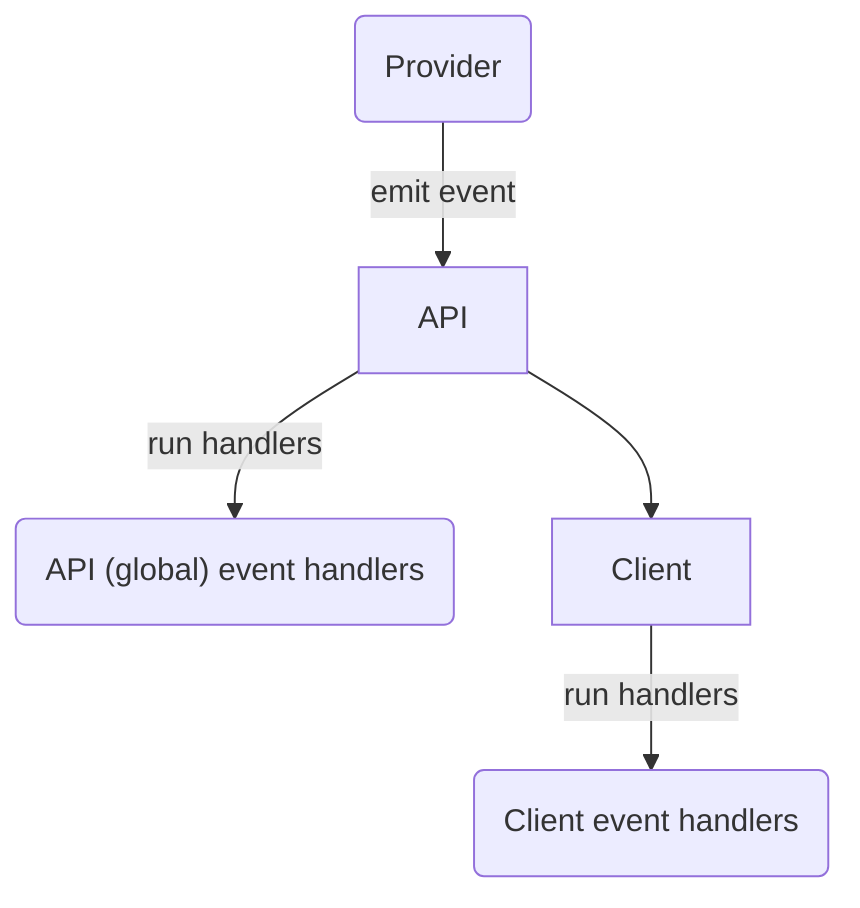

# 5. Events

[](https://github.com/open-feature/spec/tree/main/specification#experimental)

## Overview

`Events` allow consumers (_application integrator_, _application author_, _integration author_) to react to state changes in the provider or underlying flag management system, such as flag definition changes, provider readiness, or error conditions. A provider may emit events or run a callback indicating that it received a certain event, optionally providing data associated with that event. Handlers registered on the `client` or the global `API` are then invoked with this data.

The data that providers supply in event payloads may include a list of `flag keys` changed, error messages, and possibly updated flag values.



### 5.1. Provider events

#### Requirement 5.1.1

> The `provider` **MAY** define a mechanism for signaling the occurrence of one of a set of events, including `PROVIDER_READY`, `PROVIDER_ERROR`, `PROVIDER_CONFIGURATION_CHANGED` and `PROVIDER_STALE`, with an `provider event details` payload. 

If available, native event-emitter or observable/observer language constructs can be used.

see: [provider event types](../types.md#provider-events), [`event details`](../types.md#provider-event-details).

#### Requirement 5.1.2

> When a `provider` signals the occurrence of a particular `event`, the associated `client` and `API` `event handlers` **MUST** run.

see: [provider event types](./../types.md#provider-events) and [event handlers](#52-event-handlers).

#### Requirement 5.1.3

> When a `provider` signals the occurrence of a particular `event`, `event handlers` on clients which are not associated with that provider **MUST NOT** run.

Providers bound to a named client constitute their own scope events scope.

see: [setting a provider](./01-flag-evaluation.md#setting-a-provider)

#### Requirement 5.1.4

> `PROVIDER_ERROR` events **SHOULD** populate the `provider event details`'s `error message` field.

The error message field should contain an informative message as to the nature of the error.

See [event metadata](../types.md#error-event-details)

### 5.2. Event handlers

#### Requirement 5.2.1

> The `client` **MUST** provide an `addHandler` function for associating callbacks with `provider events`, which accepts an `event type` and a `event handler function`.

```java
  // run the myClientOnReadyHandler function when the PROVIDER_READY event is fired
  client.addHandler(ProviderEvents.Ready, MyClass::myClientOnReadyHandler);
```

see: [provider events](#51-provider-events)

#### Requirement 5.2.2

> The `API` **MUST** provide an `addHandler` function for associating callbacks with `provider events`, which accepts an `event type` and a `event handler function`.

```java
  // run the myGlobalErrorHandler function when the PROVIDER_READY event is fired
  OpenFeature.addHandler(ProviderEvents.Error, MyClass::myGlobalErrorHandler);
```

see: [provider events](#51-provider-events), [`provider event types`](../types.md#provider-events)

#### Requirement 5.2.3

> The `event details` **MUST** contain the `client name` associated with the event.

The `client name` indicates the client/provider with which the event is associated.
This is particularly relevant for `event handler functions` which are attached to the `API`, not a particular client.

#### Requirement 5.2.4

> The `event handler` function **MUST** accept a `event details` parameter.

see: [`event details`](../types.md#event-details)

#### Requirement 5.2.5

> If a `handler functions` terminates abnormally, other event handlers **MUST** run.

#### Requirement 5.2.6

> Event handlers **MUST** persist across `provider` changes.

Behavior of event handlers should be independent of the order of handler addition and provider configuration.

### Event handlers and initialization

Though providers themselves need not implement events, the `flag evaluation API` uses events to convey relevant state changes during configuration and initialization.
_Application authors_ and _application integrators_ use these events to wait for proper initialization of the SDK and provider and to do basic monitoring.

#### Requirement 5.3.1

> If the provider's `initialize` function terminates normally, `PROVIDER_READY` handlers **MUST** run.

See [provider initialization](./02-providers.md#24-initialization) and [setting a provider](./01-flag-evaluation.md#setting-a-provider).

#### Requirement 5.3.2

> If the provider's `initialize` function terminates abnormally, `PROVIDER_ERROR` handlers **MUST** run.

A failed initialization could represent an unrecoverable error, such as bad credentials or a missing file. 
If a failed initialization could also represent a transient error.
A provider which maintains a persistent connection to a remote `flag management system` may attempt to reconnect, and emit `PROVIDER_READY` after a failed initialization.

See [provider initialization](./02-providers.md#24-initialization) and [setting a provider](./01-flag-evaluation.md#setting-a-provider).

#### Requirement 5.3.3

> `PROVIDER_READY` handlers attached after the provider is already in a ready state **MUST** run immediately.

See [provider initialization](./02-providers.md#24-initialization) and [setting a provider](./01-flag-evaluation.md#setting-a-provider).
