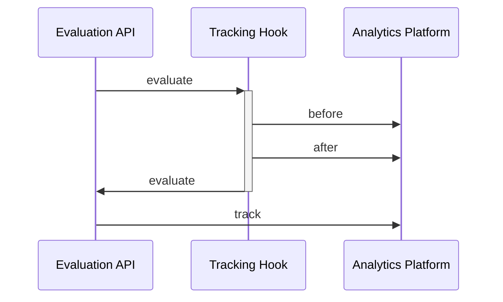

# 6. Tracking

[](https://github.com/open-feature/spec/tree/main/specification#experimental)

## Overview

The `tracking API` enables the association of feature flag evaluations with subsequent actions or application states, in order to facilitate experimentation and analysis of the impact of feature flags on business objectives.

Combined with hooks which report feature flag evaluations to the analytics platform in question, tracking can allow for robust experimentation even for flag management systems that don't support tracking directly.



### 6.1. Tracking API

#### Condition 6.1.1

> The implementation uses the dynamic-context paradigm.

see: [dynamic-context paradigm](../glossary.md#dynamic-context-paradigm)

##### Conditional Requirement 6.1.1.1

> The `client` **MUST** define a function for tracking the occurrence of a particular action or application state, with parameters `tracking event name` (string, required), `evaluation context` (optional) and `tracking event details` (optional), which returns nothing.

```java
// example tracking event recording that a subject reached a page associated with a business goal
client.track("visited-promo-page", evaluationContext);

// example tracking event recording that a subject performed an action associated with a business goal, with the tracking event details having a particular numeric value
client.track("clicked-checkout", evaluationContext, new TrackingEventDetails(99.77));

// example tracking event recording that a subject performed an action associated with a business goal, with the tracking event details having a particular numeric value
client.track("clicked-checkout", evaluationContext, new TrackingEventDetails(99.77).add("currencyCode", "USD"));
```

See [evaluation context](../types.md#evaluation-context), [tracking event details](#62-tracking-event-details).

#### Condition 6.1.2

[](https://github.com/open-feature/spec/tree/main/specification#experimental)

> The implementation uses the static-context paradigm.

see: [static-context paradigm](../glossary.md#static-context-paradigm)

##### Conditional Requirement 6.1.2.1

> The `client` **MUST** define a function for tracking the occurrence of a particular action or application state, with parameters `tracking event name` (string, required) and `tracking event details` (optional), which returns nothing.

The track function is a void function (function returning nothing).
Though it may be associated with network activity or other I/O, it need not be awaited by application authors.

```java
// example tracking event recording that a subject reached a page associated with a business goal
client.track("visited-promo-page");

// example tracking event recording that a subject performed an action associated with a business goal, with the tracking event details having a particular numeric value
client.track("clicked-checkout", new TrackingEventDetails(99.77));

// example tracking event recording that a subject performed an action associated with a business goal, with the tracking event details having a particular numeric and some additional details
client.track("clicked-checkout", new TrackingEventDetails(99.77).add("currencyCode", "USD"));
```

#### Requirement 6.1.3

> The evaluation context passed to the provider's track function **MUST** be merged in the order: API (global; lowest precedence) -> transaction -> client -> invocation (highest precedence), with duplicate values being overwritten.

The SDK passes a merged evaluation context to the provider's track function similarly to the manner it does in resolvers.

See: [context levels and merging](./03-evaluation-context.md#32-context-levels-and-merging).

#### Requirement 6.1.4

> If the client's `track` function is called and the associated provider does not implement tracking, the client's `track` function **MUST** no-op.

### 6.2. Tracking Event Details

The `tracking event details` structure defines optional data pertinent to a particular `tracking event`.

#### Requirement 6.2.1

> The `tracking event details` structure **MUST** define an optional numeric `value`, associating a scalar quality with an `tracking event`.

`Value` is a well-defined field which some providers may map to equivalent numeric values in their API.

See [provider tracking support](./02-providers.md#27-tracking-support).

#### Requirement 6.2.2

> The `tracking event details` **MUST** support the inclusion of custom fields, having keys of type `string`, and values of type `boolean | string | number | structure`.

The `tracking event details` supports the addition of arbitrary fields, including nested objects, similar to the `evaluation context` and object-typed flag values.

See [structure](../types.md#structure), [evaluation context](.//03-evaluation-context.md).